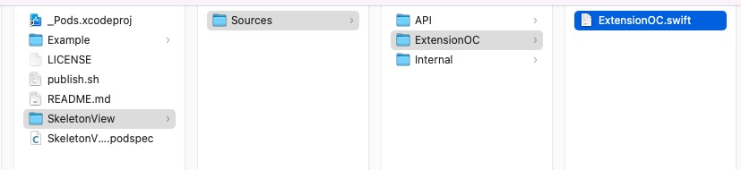
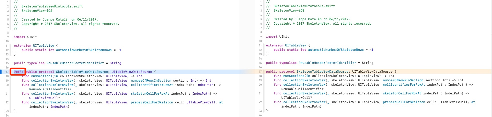
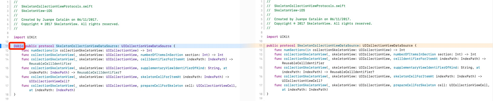

# Base on SkeletonView

https://github.com/Juanpe/SkeletonView

SkeletonView supports OC. 

# Demo Video
[local resource path](./Document/DemoVideo.mp4)

https://user-images.githubusercontent.com/15815809/178189868-f81d493f-07f0-424b-aae0-9661b9d41c1d.mp4

# 兼容OC改动记录

## 1. 新增一个扩展文件

## 2. 两个协议新增 `@objc`

### `SkeletonTableViewDataSource`

### `SkeletonCollectionViewDataSource`

