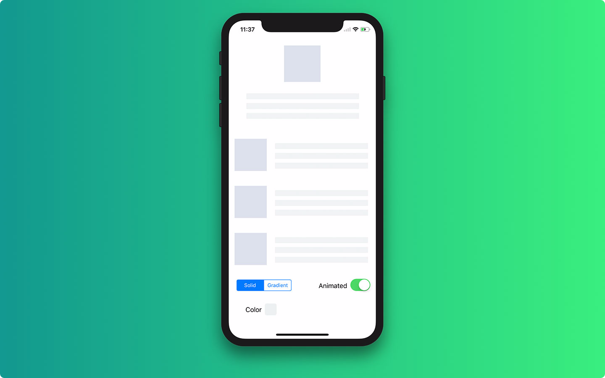
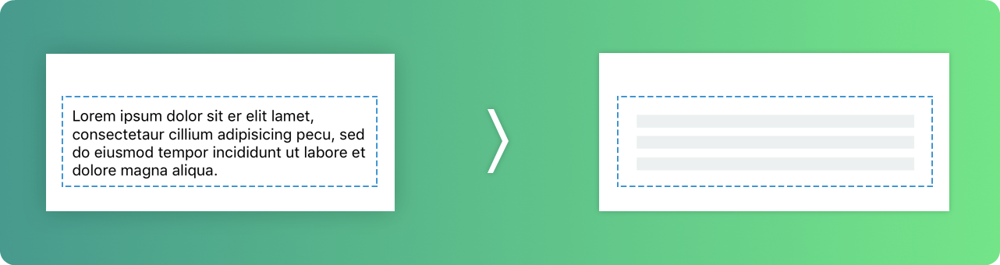

<p align="center">
    
    <a href="https://cocoapods.org/pods/SkeletonView">
        
    </a>
    <a href="https://github.com/Carthage/Carthage">
        
    </a>
    <a href="https://twitter.com/juanpe_catalan">
        
    </a>
    <a href="https://opensource.org/licenses/MIT">
  
</a>
</p>


## 🌟 Features

- [x] Easy to use
- [x] All UIViews are skeletonables
- [x] Fully customizable
- [x] Universal (iPhone & iPad)
- [x] Interface Builder friendly
- [x] Simple Swift syntax
- [x] Lightweight readable codebase

### 📋 Supported OS & SDK Versions

* iOS 9.0+
* Swift 4

### 🎤 Introduction

*Project generated with [SwiftPlate](https://github.com/JohnSundell/SwiftPlate)*

### 🔮 Example

To run the example project, clone the repo, and run `SkeletonViewExample` target.



## 📲 Installation

#### Using [CocoaPods](https://cocoapods.org)

Edit your `Podfile` and specify the dependency:

```ruby
pod "SkeletonView"
```

#### Using [Carthage](https://github.com/carthage)

Edit your `Cartfile` and specify the dependency:

```bash
github "Juanpe/SkeletonView"
```

## 🐒 How to use

You only need **3** steps to use `SkeletonView`:

**1.** Import SkeletonView in proper place.
```swift
import SkeletonView
```

**2.** Now, set what views will be `skeletonables`. You can do this by two ways:

**Using code:**
```swift
avatarImageView.isSkeletonable = true
```
**Using IB/Storyboards:**


**3.** Then, when you set the views, you can show the **skeleton**. To do it, you have **4** choices:

```swift
(1) view.showSkeleton()                 // Solid
(2) view.showGradientSkeleton()         // Gradient
(3) view.showAnimatedSkeleton()         // Solid animated
(4) view.showAnimatedGradientSkeleton() // Gradient animated
```

**Preview**

<table>
<tr>
<td width="25%">
<center>Solid</center>
</td>
<td width="25%">
<center>Gradient</center>
</td>
<td width="25%">
<center>Solid Animated</center>
</td>
<td width="25%">
<center>Gradient Animated</center>
</td>
</tr>
<tr>
<td width="25%">
</img>
</td>
<td width="25%">
</img>
</td>
<td width="25%">
</img>
</td>
<td width="25%">
</img>
</td>
</tr>
</table>

> **IMPORTANT!**
>>```SkeletonView``` is recursive, so if you want show the skeleton in all skeletonable views, you only need execute the show method in the main container view. For example, with UIViewControllers

### 🌿 Collections

Now, ```SkeletonView``` only is compatible with ```UITableView```. We are working hard to support ```UICollectionView``` too :musle:

If you want to show the skeleton in a ```UITableView```, you need to conform ```SkeletonTableViewDataSource``` protocol.

``` swift
public protocol SkeletonTableViewDataSource: UITableViewDataSource {
    func numSections(in collectionSkeletonView: UITableView) -> Int
    func collectionSkeletonView(_ skeletonView: UITableView, numberOfRowsInSection section: Int) -> Int
    func collectionSkeletonView(_ skeletonView: UITableView, cellIdenfierForRowAt indexPath: IndexPath) -> ReusableCellIdentifier
}
```
You can see, this protocol inherit from ```UITableViewDataSource``, so you can replace this protocol for the skeleton protocol.

This protocol has a default implementation:

``` swift
func numSections(in collectionSkeletonView: UITableView) -> Int // Default 1
```

``` swift
func collectionSkeletonView(_ skeletonView: UITableView, numberOfRowsInSection section: Int) -> Int
// Default:
// It calculates how many cells need to populate whole tableview
```

 so you only need to specify the cell identifier for cells.

### 📰 Multiline text




When you use elements with texts. ```SkeletonView``` draws lines to simulate text.
Also, you can decide how many lines you want. If you set ```numberOfLines``` to zero, then it will calculate how many lines you need to populate whole skeleton and it will be included. Instead, if you set to one, two or another number greater than zero, only it will included this number of lines.

### 🎨 Custom colors

You can decide what color is tinted the skeleton. You only need to pass as parameter what color or gradient you want.

**Using solid colors**
``` swift
view.showSkeleton(usingColor: UIColor.midnightBlue) // Solid
```
**Using gradients**
``` swift
let gradient = SkeletonGradient(baseColor: UIColor.midnightBlue)
view.showGradientSkeleton(usingGradient: gradient) // Gradient
```

```SkeletonView``` features 20 flat colors 🤙🏼:


###### Image captured from website [https://flatuicolors.com](https://flatuicolors.com)

### 🤓 Custom animations

Now, ```SkeletonView``` has built-in two animations, *pulse* for solid skeletons and *sliding* for gradients. It's by default.

But, if you want to do your own skeleton animation, it's very simple. You need indicate as parameters a ```SkeletonLayerAnimation```

```swift
public typealias SkeletonLayerAnimation = (CALayer) -> CAAnimation
```

Then, you can execute the next code to show the skeleton:

```swift
view.showAnimatedSkeleton { (layer) -> CAAnimation in
  // Insert here your animation
}
```

### 👨‍👧‍👦 Hierarchy

```SkeletonView``` is recursive, so to improve the performance, we need to stop recursive method as soon as possible. For this reason, you must set Skeletonable the container view, because if the container doesn't is Skeletonable break the loop.

Better with some examples:

> ```ìsSkeletonable```= ☠️

| Configuration | Result
|------- | -------
| | 
| | 
| | 
| | 


### 📚 Documentation
Coming soon...😅

## ❤️ Contributed
This is an open source project, so feel free to contribute. How?
- Open an [issue](https://github.com/Juanpe/SkeletonView/issues/new).
- Send feedback via [email](mailto://juanpecatalan.com).
- Propose your own fixes, suggestions and open a pull request with the changes.

See [all contributors](https://github.com/Juanpe/SkeletonView/graphs/contributors)

## 👨🏻‍💻 Author
[1.1]: http://i.imgur.com/tXSoThF.png
[1]: http://www.twitter.com/juanpe_catalan

* Juanpe Catalán [![alt text][1.1]][1]

## 👮🏻 License

```
MIT License

Copyright (c) 2017 swift-code

Permission is hereby granted, free of charge, to any person obtaining a copy
of this software and associated documentation files (the "Software"), to deal
in the Software without restriction, including without limitation the rights
to use, copy, modify, merge, publish, distribute, sublicense, and/or sell
copies of the Software, and to permit persons to whom the Software is
furnished to do so, subject to the following conditions:

The above copyright notice and this permission notice shall be included in all
copies or substantial portions of the Software.

THE SOFTWARE IS PROVIDED "AS IS", WITHOUT WARRANTY OF ANY KIND, EXPRESS OR
IMPLIED, INCLUDING BUT NOT LIMITED TO THE WARRANTIES OF MERCHANTABILITY,
FITNESS FOR A PARTICULAR PURPOSE AND NONINFRINGEMENT. IN NO EVENT SHALL THE
AUTHORS OR COPYRIGHT HOLDERS BE LIABLE FOR ANY CLAIM, DAMAGES OR OTHER
LIABILITY, WHETHER IN AN ACTION OF CONTRACT, TORT OR OTHERWISE, ARISING FROM,
OUT OF OR IN CONNECTION WITH THE SOFTWARE OR THE USE OR OTHER DEALINGS IN THE
SOFTWARE.
```
