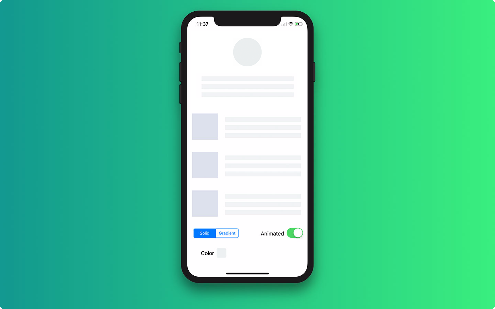
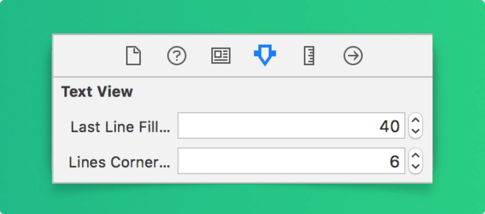
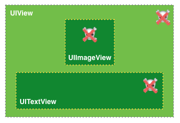
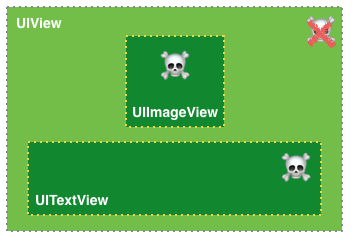
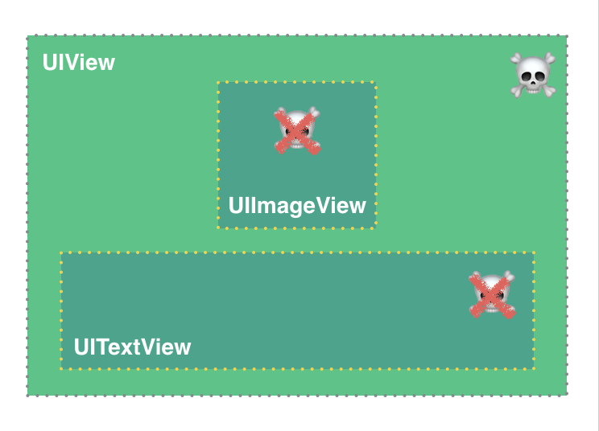
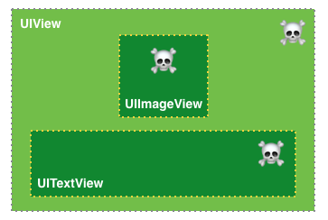

<p align="center">
    <a href="https://travis-ci.org/Juanpe/SkeletonView">
      
    </a>
    
    <a href="https://cocoapods.org/pods/SkeletonView">
        
    </a>
    <a href="https://github.com/Carthage/Carthage">
        
    </a>
    <a href="https://twitter.com/JuanpeCatalan">
        
    </a>
    <a href="https://opensource.org/licenses/MIT">
      
    </a>
    <a href="https://twitter.com/intent/tweet?text=Wow%20This%20library%20is%20awesome:&url=https%3A%2F%2Fgithub.com%2FJuanpe%2FSkeletonView">
      
    </a>
</p>

Today almost all apps have async processes, such as Api requests, long running processes, etc. And while the processes are working, usually developers place a loading view to show users that something is going on.

```SkeletonView``` has been conceived to address this need, an elegant way to show users that something is happening and also prepare them to which contents he is waiting.

Enjoy it! 🙂

* [Features](#-features)
* [Requirements](#-supported-os--sdk-versions)
* [Example Project](#-example)
* [Installation](#-installation)
  * [Cocoapods](#using-cocoapods)
  * [Carthage](#using-carthage)
* [How to use](#-how-to-use)
  * [Collections](#-collections)
  * [Multiline text](#-multiline-text)
  * [Custom colors](#-custom-colors)
  * [Custom animations](#-custom-animations)
  * [Hierarchy](#-hierarchy)
* [Documentation](#-documentation)
* [Next steps](#-next-steps)
* [Contributed](#-contributed)
* [Author](#-author)
* [License](#-license)


## 🌟 Features

- [x] Easy to use
- [x] All UIViews are skeletonables
- [x] Fully customizable
- [x] Universal (iPhone & iPad)
- [x] Interface Builder friendly
- [x] Simple Swift syntax
- [x] Lightweight readable codebase

### 📋 Supported OS & SDK Versions

* iOS 9.0+
* Swift 4

### 🔮 Example

To run the example project, clone the repo and run `SkeletonViewExample` target.



## 📲 Installation

#### Using [CocoaPods](https://cocoapods.org)

Edit your `Podfile` and specify the dependency:

```ruby
pod "SkeletonView"
```

#### Using [Carthage](https://github.com/carthage)

Edit your `Cartfile` and specify the dependency:

```bash
github "Juanpe/SkeletonView"
```

## 🐒 How to use

Only **3** steps needed to use `SkeletonView`:

**1.** Import SkeletonView in proper place.
```swift
import SkeletonView
```

**2.** Now, set which views will be `skeletonables`. You achieve this in two ways:

**Using code:**
```swift
avatarImageView.isSkeletonable = true
```
**Using IB/Storyboards:**


**3.** Once you've set the views, you can show the **skeleton**. To do so, you have **4** choices:

```swift
(1) view.showSkeleton()                 // Solid
(2) view.showGradientSkeleton()         // Gradient
(3) view.showAnimatedSkeleton()         // Solid animated
(4) view.showAnimatedGradientSkeleton() // Gradient animated
```

**Preview**

<table>
<tr>
<td width="25%">
<center>Solid</center>
</td>
<td width="25%">
<center>Gradient</center>
</td>
<td width="25%">
<center>Solid Animated</center>
</td>
<td width="25%">
<center>Gradient Animated</center>
</td>
</tr>
<tr>
<td width="25%">
</img>
</td>
<td width="25%">
</img>
</td>
<td width="25%">
</img>
</td>
<td width="25%">
</img>
</td>
</tr>
</table>

> **IMPORTANT!**
>>```SkeletonView``` is recursive, so if you want show the skeleton in all skeletonable views, you only need to call the show method in the main container view. For example, with UIViewControllers

### 🌿 Collections

 Now, ```SkeletonView``` is compatible with ```UITableView``` and ```UICollectionView```.

###### UITableView

If you want to show the skeleton in a ```UITableView```, you need to conform to ```SkeletonTableViewDataSource``` protocol.

``` swift
public protocol SkeletonTableViewDataSource: UITableViewDataSource {
    func numSections(in collectionSkeletonView: UITableView) -> Int
    func collectionSkeletonView(_ skeletonView: UITableView, numberOfRowsInSection section: Int) -> Int
    func collectionSkeletonView(_ skeletonView: UITableView, cellIdenfierForRowAt indexPath: IndexPath) -> ReusableCellIdentifier
}
```
As you can see, this protocol inherits from ```UITableViewDataSource```, so you can replace this protocol with the skeleton protocol.

This protocol has a default implementation:

``` swift
func numSections(in collectionSkeletonView: UITableView) -> Int
// Default: 1
```

``` swift
func collectionSkeletonView(_ skeletonView: UITableView, numberOfRowsInSection section: Int) -> Int
// Default:
// It calculates how many cells need to populate whole tableview
```

There is only one method you need to implement to let Skeleton know the cell identifier. This method doesn't have default implementation:
 ``` swift
 func collectionSkeletonView(_ skeletonView: UITableView, cellIdenfierForRowAt indexPath: IndexPath) -> ReusableCellIdentifier
 ```

**Example**
 ``` swift
 func collectionSkeletonView(_ skeletonView: UITableView, cellIdenfierForRowAt indexPath: IndexPath) -> ReusableCellIdentifier {
    return "CellIdentifier"
}
 ```

> **IMPORTANT!**
> If you are using resizable cells (`tableView.rowHeight = UITableViewAutomaticDimension` ), it's mandatory define the `estimatedRowHeight`.

###### UICollectionView

For ```UICollectionView```, you need to conform to ```SkeletonCollectionViewDataSource``` protocol.

``` swift
public protocol SkeletonCollectionViewDataSource: UICollectionViewDataSource {
    func numSections(in collectionSkeletonView: UICollectionView) -> Int
    func collectionSkeletonView(_ skeletonView: UICollectionView, numberOfItemsInSection section: Int) -> Int
    func collectionSkeletonView(_ skeletonView: UICollectionView, cellIdentifierForItemAt indexPath: IndexPath) -> ReusableCellIdentifier
}
```

The rest of the process is the same as ```UITableView```

### 📰 Multiline text


When using elements with text, ```SkeletonView``` draws lines to simulate text.
Besides, you can decide how many lines you want. If  ```numberOfLines``` is set to zero, it will calculate how many lines needed to populate the whole skeleton and it will be drawn. Instead, if you set it to one, two or any number greater than zero, it will only draw this number of lines.

**NEW** Now, you can set the filling percent of the last line. **Default: 70%**

To modify the percent **using code**, set the property:
```swift
descriptionTextView.lastLineFillPercent = 50
```

Or, if you prefer use **IB/Storyboard**:




### 🎨 Custom colors

You can decide which color the skeleton is tinted with. You only need to pass as a parameter the color or gradient you want.

**Using solid colors**
``` swift
view.showSkeleton(usingColor: UIColor.gray) // Solid
// or
view.showSkeleton(usingColor: UIColor(red: 25.0, green: 30.0, blue: 255.0, alpha: 1.0))
```
**Using gradients**
``` swift
let gradient = SkeletonGradient(baseColor: UIColor.midnightBlue)
view.showGradientSkeleton(usingGradient: gradient) // Gradient
```

Besides, ```SkeletonView``` features 20 flat colors 🤙🏼

```UIColor.turquoise, UIColor.greenSea, UIColor.sunFlower, UIColor.flatOrange  ...```


###### Image captured from website [https://flatuicolors.com](https://flatuicolors.com)

### 🤓 Custom animations

Now, ```SkeletonView``` has two built-in animations, *pulse* for solid skeletons and *sliding* for gradients.

Besides, if you want to do your own skeleton animation, it's really easy.


Skeleton provides the `showAnimatedSkeleton` function which has a ```SkeletonLayerAnimation``` closure where you can define your custom animation.

```swift
public typealias SkeletonLayerAnimation = (CALayer) -> CAAnimation
```

You can call the function like this:

```swift
view.showAnimatedSkeleton { (layer) -> CAAnimation in
  let animation = CAAnimation()
  // Customize here your animation

  return animation
}
```

**NEW** It's available ```SkeletonAnimationBuilder```. It's a builder to make ```SkeletonLayerAnimation```.

Today, you can create **sliding animations** for gradients, deciding the **direction** and setting the **duration** of the animation (default = 1.5s).

```swift
// func makeSlidingAnimation(withDirection direction: GradientDirection, duration: CFTimeInterval = 1.5) -> SkeletonLayerAnimation

let animation = SkeletonAnimationBuilder().makeSlidingAnimation(withDirection: .leftToRight)
view.showAnimatedGradientSkeleton(usingGradient: gradient, animation: animation)

```

```GradientDirection``` is an enum, with this cases:

|  Direction | Preview
|------- | -------
| .leftRight | 
| .rightLeft | 
| .topBottom |   
| .bottomTop | 
| .topLeftBottomRight | 
| .bottomRightTopLeft | 

> **😉 TRICK!**
Exist another way to create sliding animations, just using this shortcut:
>>```let animation = GradientDirection.leftToRight.slidingAnimation()```

### 👨‍👧‍👦 Hierarchy

Since ```SkeletonView``` is recursive, and we want skeleton to be very efficient, we want to stop recursion as soon as possible. For this reason, you must set the container view as `Skeletonable`, because Skeleton will stop looking for `skeletonable` subviews as soon as a view is not Skeletonable, breaking then the recursion.

Because an image is worth a thousand words:

> ```ìsSkeletonable```= ☠️

| Configuration | Result
|------- | -------
| | 
| | 
| | 
| | 


### 📚 Documentation
Coming soon...😅

## 📬 Next steps

* [x] Set the filling percent of the last line in multiline elements
* [x] Add more gradient animations
* [x] Supported resizable cells
* [x] CollectionView compatible
* [ ] Add recovery state
* [ ] Custom collections compatible
* [ ] Add animations when it shows/hides the skeletons
* [ ] MacOS and WatchOS compatible

## ❤️ Contributed
This is an open source project, so feel free to contribute. How?
- Open an [issue](https://github.com/Juanpe/SkeletonView/issues/new).
- Send feedback via [email](mailto://juanpecatalan.com).
- Propose your own fixes, suggestions and open a pull request with the changes.

See [all contributors](https://github.com/Juanpe/SkeletonView/graphs/contributors)

###### Project generated with [SwiftPlate](https://github.com/JohnSundell/SwiftPlate)

## 👨🏻‍💻 Author
[1.1]: http://i.imgur.com/tXSoThF.png
[1]: http://www.twitter.com/JuanpeCatalan

* Juanpe Catalán [![alt text][1.1]][1]

## 👮🏻 License

```
MIT License

Copyright (c) 2017 Juanpe Catalán

Permission is hereby granted, free of charge, to any person obtaining a copy
of this software and associated documentation files (the "Software"), to deal
in the Software without restriction, including without limitation the rights
to use, copy, modify, merge, publish, distribute, sublicense, and/or sell
copies of the Software, and to permit persons to whom the Software is
furnished to do so, subject to the following conditions:

The above copyright notice and this permission notice shall be included in all
copies or substantial portions of the Software.

THE SOFTWARE IS PROVIDED "AS IS", WITHOUT WARRANTY OF ANY KIND, EXPRESS OR
IMPLIED, INCLUDING BUT NOT LIMITED TO THE WARRANTIES OF MERCHANTABILITY,
FITNESS FOR A PARTICULAR PURPOSE AND NONINFRINGEMENT. IN NO EVENT SHALL THE
AUTHORS OR COPYRIGHT HOLDERS BE LIABLE FOR ANY CLAIM, DAMAGES OR OTHER
LIABILITY, WHETHER IN AN ACTION OF CONTRACT, TORT OR OTHERWISE, ARISING FROM,
OUT OF OR IN CONNECTION WITH THE SOFTWARE OR THE USE OR OTHER DEALINGS IN THE
SOFTWARE.
```
