<p align="center">
    <a href="https://github.com/Juanpe/SkeletonView/actions?query=workflow%3ACI">
      
    </a>
    <a href="https://codebeat.co/projects/github-com-juanpe-skeletonview-main"></a>
    <a href="https://cocoapods.org/pods/SkeletonView"></a>
    <a href="https://github.com/Carthage/Carthage/"></a>
    <a href="https://swift.org/package-manager/"></a>
    
    <a href="https://badge.bow-swift.io/recipe?name=SkeletonView&description=An%20elegant%20way%20to%20show%20users%20that%20something%20is%20happening%20and%20also%20prepare%20them%20to%20which%20contents%20he%20is%20waiting&url=https://github.com/juanpe/skeletonview&owner=Juanpe&avatar=https://avatars0.githubusercontent.com/u/1409041?v=4&tag=1.20.0"></a>   
</p>

<p align="center">
    <a href="#-features">Features</a>
  • <a href="#-guides">Guides</a>
  • <a href="#-installation">Installation</a>
  • <a href="#-usage">Usage</a>
  • <a href="#-miscellaneous">Miscellaneous</a>
  • <a href="#️-contributing">Contributing</a>
</p>

**🌎 README is available in other languages:  [🇪🇸](Translations/README_es.md) . [🇨🇳](Translations/README_zh.md) . [🇧🇷](Translations/README_pt-br.md) . [🇰🇷](Translations/README_ko.md) . [🇫🇷](Translations/README_fr.md)**

Today almost all apps have async processes, such as API requests, long running processes, etc. While the processes are working, usually developers place a loading view to show users that something is going on.

**SkeletonView** has been conceived to address this need, an elegant way to show users that something is happening and also prepare them for which contents are waiting.

Enjoy it! 🙂


##
- [🌟 Features](#-features)
- [🎬 Guides](#-guides)
- [📲 Installation](#-installation)
- [🐒 Usage](#-usage)
  - [🌿 Collections](#-collections)
  - [🔠 Texts](#-texts)
  - [🦋 Appearance](#-appearance)
  - [🎨 Custom colors](#-custom-colors)
  - [🏃‍♀️ Animations](#️-animations)
  - [🏄 Transitions](#-transitions)
- [✨ Miscellaneous](#-miscellaneous)
- [❤️ Contributing](#️-contributing)
- [📢 Mentions](#-mentions)
- [🏆 Sponsors](#-sponsors)
- [👨🏻‍💻 Author](#-author)
- [👮🏻 License](#-license)


## 🌟 Features

* Easy to use
* All UIViews are skeletonables
* Fully customizable
* Universal (iPhone & iPad)
* Interface Builder friendly
* Simple Swift syntax
* Lightweight readable codebase


## 🎬 Guides

| [](https://youtu.be/75kgOhWsPNA)|[](https://youtu.be/MVCiM_VdxVA)|[](https://youtu.be/Qq3Evspeea8)|[](https://www.youtube.com/watch?v=Zx1Pg1gPfxA)
|:---:  | :---:  | :---: | :---:
|[**SkeletonView Guides - Getting started**](https://youtu.be/75kgOhWsPNA)|[**How to Create Loading View with Skeleton View in Swift 5.2**](https://youtu.be/MVCiM_VdxVA)    by iKh4ever Studio|[**Create Skeleton Loading View in App (Swift 5) - Xcode 11, 2020**](https://youtu.be/Qq3Evspeea8)    by iOS Academy| [**Cómo crear una ANIMACIÓN de CARGA de DATOS en iOS**](https://www.youtube.com/watch?v=Zx1Pg1gPfxA) by MoureDev


## 📲 Installation

* [CocoaPods](https://guides.cocoapods.org/using/using-cocoapods.html):

```ruby
pod 'SkeletonView'
```

* [Carthage](https://github.com/Carthage/Carthage):

```ruby
github "Juanpe/SkeletonView"
```

* [Swift Package Manager](https://swift.org/package-manager/):

```swift
dependencies: [
  .package(url: "https://github.com/Juanpe/SkeletonView.git", from: "1.7.0")
]
```


## 🐒 Usage

Only **3** steps needed to use `SkeletonView`:

1️⃣ Import SkeletonView in proper place.
```swift
import SkeletonView
```

2️⃣ Now, set which views will be `skeletonables`. You achieve this in two ways:

**Using code:**
```swift
avatarImageView.isSkeletonable = true
```
**Using IB/Storyboards:**

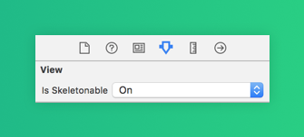

3️⃣ Once you've set the views, you can show the **skeleton**. To do so, you have **4** choices:

```swift
(1) view.showSkeleton()                 // Solid
(2) view.showGradientSkeleton()         // Gradient
(3) view.showAnimatedSkeleton()         // Solid animated
(4) view.showAnimatedGradientSkeleton() // Gradient animated
```

**Preview**

<table>
<tr>
<td width="25%">
<center>Solid</center>
</td>
<td width="25%">
<center>Gradient</center>
</td>
<td width="25%">
<center>Solid Animated</center>
</td>
<td width="25%">
<center>Gradient Animated</center>
</td>
</tr>
<tr>
<td width="25%">
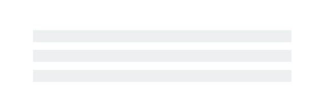</img>
</td>
<td width="25%">
</img>
</td>
<td width="25%">
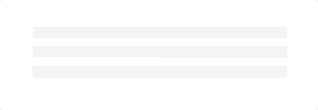</img>
</td>
<td width="25%">
</img>
</td>
</tr>
</table>


> 📣 **IMPORTANT!** 
>
> `SkeletonView` is recursive, so if you want show the skeleton in all skeletonable views, you only need to call the show method in the main container view. For example, with `UIViewControllers`.

  


### 🌿 Collections

```SkeletonView``` is compatible with ```UITableView``` and ```UICollectionView```.


**UITableView**

If you want to show the skeleton in a ```UITableView```, you need to conform to ```SkeletonTableViewDataSource``` protocol.

``` swift
public protocol SkeletonTableViewDataSource: UITableViewDataSource {
    func numSections(in collectionSkeletonView: UITableView) -> Int // Default: 1
    func collectionSkeletonView(_ skeletonView: UITableView, numberOfRowsInSection section: Int) -> Int
    func collectionSkeletonView(_ skeletonView: UITableView, cellIdentifierForRowAt indexPath: IndexPath) -> ReusableCellIdentifier
    func collectionSkeletonView(_ skeletonView: UITableView, skeletonCellForRowAt indexPath: IndexPath) -> UITableViewCell? // Default: nil
    func collectionSkeletonView(_ skeletonView: UITableView, prepareCellForSkeleton cell: UITableViewCell, at indexPath: IndexPath)
}
```
As you can see, this protocol inherits from ```UITableViewDataSource```, so you can replace this protocol with the skeleton protocol.

This protocol has a default implementation for some methods. For example, the number of rows for each section is calculated in runtime:

``` swift
func collectionSkeletonView(_ skeletonView: UITableView, numberOfRowsInSection section: Int) -> Int
// Default:
// It calculates how many cells need to populate whole tableview
```

> 📣 **IMPORTANT!** 
>
> If you return `UITableView.automaticNumberOfSkeletonRows` in the above method, it acts like the default behavior (i.e. it calculates how many cells needed to populate the whole tableview).

There is only one method you need to implement to let Skeleton know the cell identifier. This method doesn't have default implementation:
 ``` swift
 func collectionSkeletonView(_ skeletonView: UITableView, cellIdentifierForRowAt indexPath: IndexPath) -> ReusableCellIdentifier {
    return "CellIdentifier"
}
 ```
 
 By default, the library dequeues the cells from each indexPath, but you can also do this if you want to make some changes before the skeleton appears:
 ``` swift
 func collectionSkeletonView(_ skeletonView: UITableView, skeletonCellForRowAt indexPath: IndexPath) -> UITableViewCell? {
     let cell = skeletonView.dequeueReusableCell(withIdentifier: "CellIdentifier", for: indexPath) as? Cell
     cell?.textField.isHidden = indexPath.row == 0
     return cell
 }
 ```
 
If you prefer to leave the deque part to the library you can configure the cell using this method:
 ``` swift
 func collectionSkeletonView(_ skeletonView: UITableView, prepareCellForSkeleton cell: UITableViewCell, at indexPath: IndexPath) {
     let cell = cell as? Cell
     cell?.textField.isHidden = indexPath.row == 0
 }
 ```

 
Besides, you can skeletonize both the headers and footers. You need to conform to `SkeletonTableViewDelegate` protocol.

```swift
public protocol SkeletonTableViewDelegate: UITableViewDelegate {
    func collectionSkeletonView(_ skeletonView: UITableView, identifierForHeaderInSection section: Int) -> ReusableHeaderFooterIdentifier? // default: nil
    func collectionSkeletonView(_ skeletonView: UITableView, identifierForFooterInSection section: Int) -> ReusableHeaderFooterIdentifier? // default: nil
}
```

> 📣 **IMPORTANT!** 
> 
> 1️⃣ If you are using resizable cells (**`tableView.rowHeight = UITableViewAutomaticDimension`**), it's mandatory define the **`estimatedRowHeight`**.
> 
> 2️⃣ When you add elements in a **`UITableViewCell`** you should add it to **`contentView`** and not to the cell directly.
> ```swift
> self.contentView.addSubview(titleLabel) ✅         
> self.addSubview(titleLabel) ❌
> ```

  

**UICollectionView**

For `UICollectionView`, you need to conform to `SkeletonCollectionViewDataSource` protocol.

``` swift
public protocol SkeletonCollectionViewDataSource: UICollectionViewDataSource {
    func numSections(in collectionSkeletonView: UICollectionView) -> Int  // default: 1
    func collectionSkeletonView(_ skeletonView: UICollectionView, numberOfItemsInSection section: Int) -> Int
    func collectionSkeletonView(_ skeletonView: UICollectionView, cellIdentifierForItemAt indexPath: IndexPath) -> ReusableCellIdentifier
    func collectionSkeletonView(_ skeletonView: UICollectionView, supplementaryViewIdentifierOfKind: String, at indexPath: IndexPath) -> ReusableCellIdentifier? // default: nil
    func collectionSkeletonView(_ skeletonView: UICollectionView, skeletonCellForItemAt indexPath: IndexPath) -> UICollectionViewCell?  // default: nil
    func collectionSkeletonView(_ skeletonView: UICollectionView, prepareCellForSkeleton cell: UICollectionViewCell, at indexPath: IndexPath)
}
```

The rest of the process is the same as ```UITableView```


### 🔠 Texts

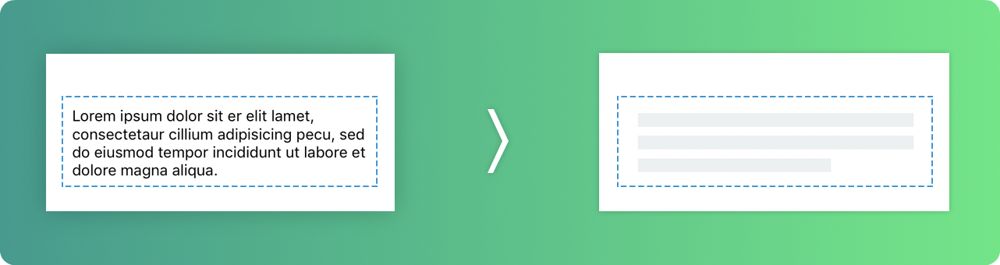

When using elements with text, ```SkeletonView``` draws lines to simulate text.

You can set some properties for multilines elements.

| Property | Type | Default | Preview
| ------- | ------- |------- | -------
| **lastLineFillPercent**  | `CGFloat` | `70`| 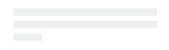
| **linesCornerRadius**  | `Int` | `0` | 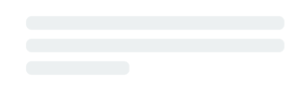
| **skeletonLineSpacing**  | `CGFloat` | `10` | 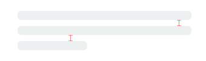
| **skeletonPaddingInsets**  | `UIEdgeInsets` | `.zero` | 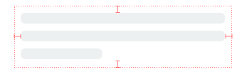
| **skeletonTextLineHeight**  | `SkeletonTextLineHeight` | `.fixed(15)` | 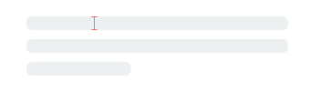
| **skeletonTextNumberOfLines**  | `SkeletonTextNumberOfLines` | `.inherited` | 

<br />

To modify the percent or radius **using code**, set the properties:
```swift
descriptionTextView.lastLineFillPercent = 50
descriptionTextView.linesCornerRadius = 5
```

Or, if you prefer use **IB/Storyboard**:


<br />

**How to define the number of lines?**


By default, the number of lines is the same as the value of the `numberOfLines` property. And, if it's set to **zero**, it'll calculate how many lines are needed to populate the whole skeleton and draw it.

However, if you want to set a specific number of skeleton lines you can do it by setting the `skeletonTextNumberOfLines` property. This property has two possible values, `inherited` which returns `numberOfLines` value and `custom(Int)` which returns the specific number of lines specified as the associated value. 

For example:

```swift
label.skeletonTextNumberOfLines = 3   // .custom(3)
``` 

<br />

> **⚠️ DEPRECATED!**
>
> **useFontLineHeight** has been deprecated. You can use **skeletonTextLineHeight** instead:
> ```swift
> descriptionTextView.skeletonTextLineHeight = .relativeToFont
> ```

> **📣 IMPORTANT!**
>
> Please note that for views without multiple lines, the single line will be considered 
> as the last line.


### 🦋 Appearance

The skeletons have a default appearance. So, when you don't specify the color, gradient or multilines properties, `SkeletonView` uses the default values.

Default values:
- **tintColor**: `UIColor`
    - *default: `.skeletonDefault` (same as `.clouds` but adaptive to dark mode)*
- **gradient**: SkeletonGradient
  - *default: `SkeletonGradient(baseColor: .skeletonDefault)`*
- **multilineHeight**: `CGFloat`
  - *default: 15*
- **multilineSpacing**: `CGFloat`
  - *default: 10*
- **multilineLastLineFillPercent**: `Int`
  - *default: 70*
- **multilineCornerRadius**: `Int`
  - *default: 0*
- **skeletonCornerRadius**: `CGFloat` (IBInspectable)  (Make your skeleton view with corner)
  - *default: 0*

To get these default values you can use `SkeletonAppearance.default`. Using this property you can set the values as well:
```swift
SkeletonAppearance.default.multilineHeight = 20
SkeletonAppearance.default.tintColor = .green
```

> **⚠️ DEPRECATED!**
>
> **useFontLineHeight** has been deprecated. You can use **textLineHeight** instead:
> ```swift
> SkeletonAppearance.default.textLineHeight = .relativeToFont
> ```


### 🎨 Custom colors

You can decide which color the skeleton is tinted with. You only need to pass as a parameter the color or gradient you want.

**Using solid colors**
```swift
view.showSkeleton(usingColor: UIColor.gray) // Solid
// or
view.showSkeleton(usingColor: UIColor(red: 25.0, green: 30.0, blue: 255.0, alpha: 1.0))
```
**Using gradients**
``` swift
let gradient = SkeletonGradient(baseColor: UIColor.midnightBlue)
view.showGradientSkeleton(usingGradient: gradient) // Gradient
```

Besides, **SkeletonView** features 20 flat colors 🤙🏼

```UIColor.turquoise, UIColor.greenSea, UIColor.sunFlower, UIColor.flatOrange  ...```

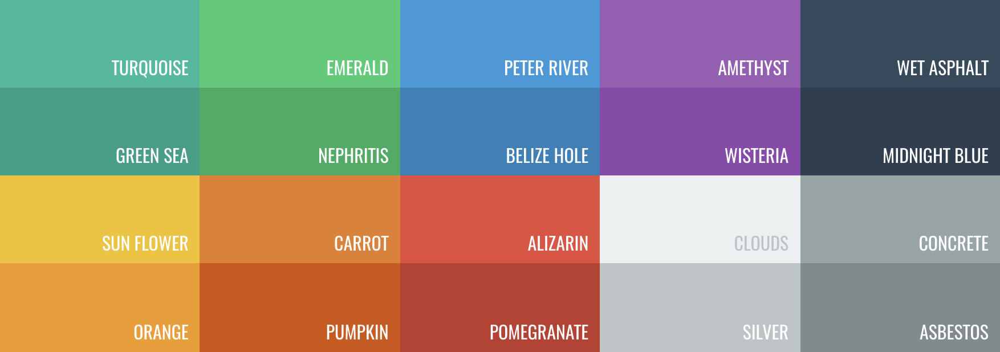
###### Image captured from website [https://flatuicolors.com](https://flatuicolors.com)


### 🏃‍♀️ Animations

**SkeletonView** has two built-in animations, *pulse* for solid skeletons and *sliding* for gradients.

Besides, if you want to do your own skeleton animation, it's really easy.


Skeleton provides the `showAnimatedSkeleton` function which has a ```SkeletonLayerAnimation``` closure where you can define your custom animation.

```swift
public typealias SkeletonLayerAnimation = (CALayer) -> CAAnimation
```

You can call the function like this:

```swift
view.showAnimatedSkeleton { (layer) -> CAAnimation in
  let animation = CAAnimation()
  // Customize here your animation

  return animation
}
```

It's available ```SkeletonAnimationBuilder```. It's a builder to make ```SkeletonLayerAnimation```.

Today, you can create **sliding animations** for gradients, deciding the **direction** and setting the **duration** of the animation (default = 1.5s).

```swift
// func makeSlidingAnimation(withDirection direction: GradientDirection, duration: CFTimeInterval = 1.5) -> SkeletonLayerAnimation

let animation = SkeletonAnimationBuilder().makeSlidingAnimation(withDirection: .leftToRight)
view.showAnimatedGradientSkeleton(usingGradient: gradient, animation: animation)

```

```GradientDirection``` is an enum, with theses cases:

|  Direction | Preview
|------- | -------
| .leftRight | 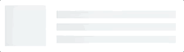
| .rightLeft | 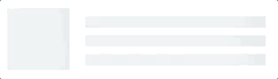
| .topBottom | 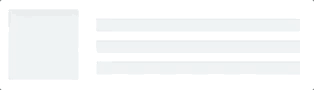
| .bottomTop | 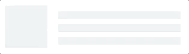
| .topLeftBottomRight | 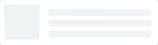
| .bottomRightTopLeft | 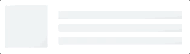

> **😉 TRICK!**
>
> Exist another way to create sliding animations, just using this shortcut:
> ```swift
> let animation = GradientDirection.leftToRight.slidingAnimation()
> ```

  

### 🏄 Transitions

**SkeletonView** has built-in transitions to **show** or **hide** the skeletons in a *smoother* way 🤙

To use the transition, simply add the ```transition``` parameter to your ```showSkeleton()``` or ```hideSkeleton()``` function with the transition time, like this:

```swift
view.showSkeleton(transition: .crossDissolve(0.25))     //Show skeleton cross dissolve transition with 0.25 seconds fade time
view.hideSkeleton(transition: .crossDissolve(0.25))     //Hide skeleton cross dissolve transition with 0.25 seconds fade time

```

The default value is  `crossDissolve(0.25)`

**Preview**

<table>
<tr>
<td width="50%">
<center>None</center>
</td>
<td width="50%">
<center>Cross dissolve</center>
</td>
</tr>
<tr>
<td width="50%">
</img>
</td>
<td width="50%">
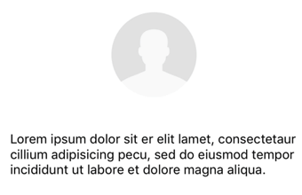</img>
</td>
</tr>
</table>


## ✨ Miscellaneous 

  

**Hierarchy**

Since ```SkeletonView``` is recursive, and we want skeleton to be very efficient, we want to stop recursion as soon as possible. For this reason, you must set the container view as `Skeletonable`, because Skeleton will stop looking for `skeletonable` subviews as soon as a view is not Skeletonable, breaking then the recursion.

Because an image is worth a thousand words:

In this example we have a `UIViewController` with a `ContainerView` and a `UITableView`. When the view is ready, we show the skeleton using this method:
```
view.showSkeleton()
```

> ```isSkeletonable```= ☠️

| Configuration | Result|
|:-------:|:-------:|
|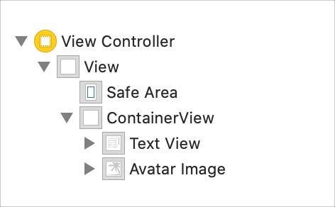 | 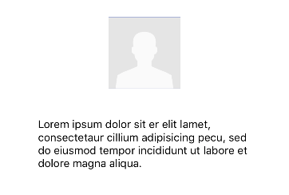|
|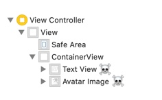 | |
|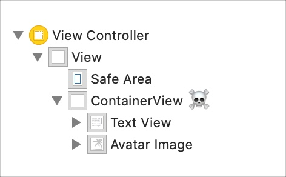 | 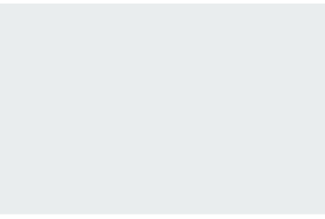|
|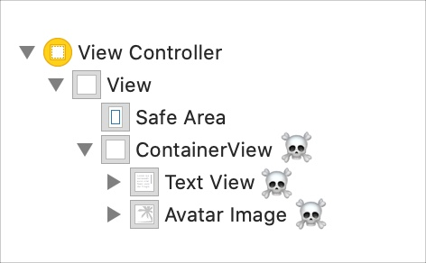| |
|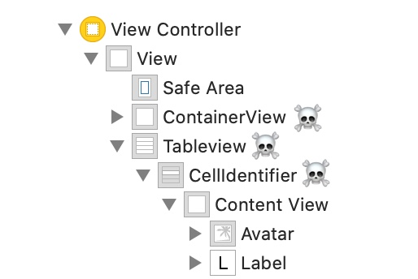 | |
|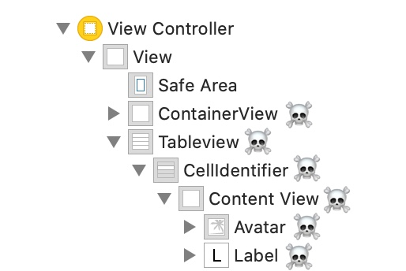 | |

  

**Skeleton views layout**

Sometimes skeleton layout may not fit your layout because the parent view bounds have changed. ~For example, rotating the device.~

You can relayout the skeleton views like so:

```swift
override func viewDidLayoutSubviews() {
    view.layoutSkeletonIfNeeded()
}
```

> 📣 **IMPORTANT!** 
> 
> You shouldn't call this method. From **version 1.8.1** you don't need to call this method, the library does automatically. So, you can use this method **ONLY** in the cases when you need to update the layout of the skeleton manually.


  

**Update skeleton**

You can change the skeleton configuration at any time like its colour, animation, etc. with the following methods:

```swift
(1) view.updateSkeleton()                 // Solid
(2) view.updateGradientSkeleton()         // Gradient
(3) view.updateAnimatedSkeleton()         // Solid animated
(4) view.updateAnimatedGradientSkeleton() // Gradient animated
```

**Hiding views when the animation starts**

Sometimes you wanna hide some view when the animation starts, so there is a quick property that you can use to make this happen:

```swift
view.isHiddenWhenSkeletonIsActive = true  // This works only when isSkeletonable = true
```

**Don't modify user interaction when the skeleton is active**


By default, the user interaction is disabled for skeletonized items, but if you don't want to modify the user interaction indicator when skeleton is active, you can use the `isUserInteractionDisabledWhenSkeletonIsActive` property:

```swift
view.isUserInteractionDisabledWhenSkeletonIsActive = false  // The view will be active when the skeleton will be active.
```

**Don't use the font line height for the skeleton lines in labels**

False to disable skeleton to auto-adjust to font height for a `UILabel` or `UITextView`. By default, the skeleton lines height is auto-adjusted to font height to more accurately reflect the text in the label rect rather than using the bounding box.

```swift
label.useFontLineHeight = false
```

**Delayed show skeleton**

You can delay the presentation of the skeleton if the views update quickly.

```swift
func showSkeleton(usingColor: UIColor,
                  animated: Bool,
                  delay: TimeInterval,
                  transition: SkeletonTransitionStyle)
```

```swift
func showGradientSkeleton(usingGradient: SkeletonGradient,
                          animated: Bool,
                          delay: TimeInterval,
                          transition: SkeletonTransitionStyle)
```

**Debug**

To facilitate the debug tasks when something is not working fine. **`SkeletonView`** has some new tools.

First, `UIView` has available a property with his skeleton info:
```swift
var sk.skeletonTreeDescription: String

```

Besides, you can activate the new **debug mode**. You just add the environment variable `SKELETON_DEBUG` and activate it.

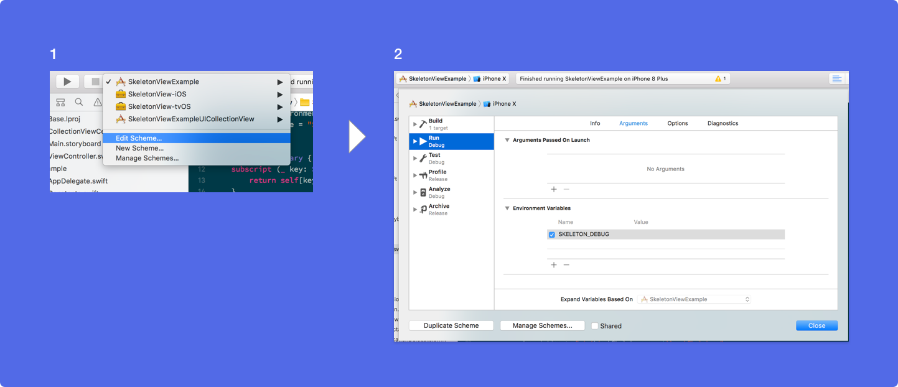

Then, when the skeleton appears, you can see the view hierarchy in the Xcode console.

```
{ 
  "type" : "UIView", // UITableView, UILabel...
  "isSkeletonable" : true,
  "reference" : "0x000000014751ce30",
  "children" : [
    {
      "type" : "UIView",
      "isSkeletonable" : true,
      "children" : [ ... ],
      "reference" : "0x000000014751cfa0"
    }
  ]
}
```
  
**Supported OS & SDK Versions**

* iOS 9.0+
* tvOS 9.0+
* Swift 5.3

## ❤️ Contributing
This is an open source project, so feel free to contribute. How?

- Open an [issue](https://github.com/Juanpe/SkeletonView/issues/new).
- Send feedback via [email](mailto://juanpecatalan.com).
- Propose your own fixes, suggestions and open a pull request with the changes.

See [all contributors](https://github.com/Juanpe/SkeletonView/graphs/contributors)

For more information, please read the [contributing guidelines](https://github.com/Juanpe/SkeletonView/blob/main/CONTRIBUTING.md).


## 📢 Mentions

- [iOS Dev Weekly #327](https://iosdevweekly.com/issues/327#start)
- [Hacking with Swift Articles](https://www.hackingwithswift.com/articles/40/skeletonview-makes-loading-content-beautiful)
- [Top 10 Swift Articles November](https://medium.mybridge.co/swift-top-10-articles-for-the-past-month-v-nov-2017-dfed7861cd65)
- [30 Amazing iOS Swift Libraries (v2018)](https://medium.mybridge.co/30-amazing-ios-swift-libraries-for-the-past-year-v-2018-7cf15027eee9)
- [AppCoda Weekly #44](http://digest.appcoda.com/issues/appcoda-weekly-issue-44-81899)
- [iOS Cookies Newsletter #103](https://us11.campaign-archive.com/?u=cd1f3ed33c6527331d82107ba&id=48131a516d)
- [Swift Developments Newsletter #113](https://andybargh.com/swiftdevelopments-113/)
- [iOS Goodies #204](http://ios-goodies.com/post/167557280951/week-204)
- [Swift Weekly #96](http://digest.swiftweekly.com/issues/swift-weekly-issue-96-81759)
- [CocoaControls](https://www.cocoacontrols.com/controls/skeletonview)
- [Awesome iOS Newsletter #74](https://ios.libhunt.com/newsletter/74)
- [Swift News #36](https://www.youtube.com/watch?v=mAGpsQiy6so)
- [Best iOS articles, new tools & more](https://medium.com/flawless-app-stories/best-ios-articles-new-tools-more-fcbe673e10d)

## 🏆 Sponsors

Open-source projects cannot live long without your help. If you find **SkeletonView** is useful, please consider supporting this 
project by becoming a sponsor. 

Become a sponsor through [GitHub Sponsors](https://github.com/sponsors/Juanpe) :heart:

## 👨🏻‍💻 Author

[Juanpe Catalán](http://www.twitter.com/JuanpeCatalan)

<a class="bmc-button" target="_blank" href="https://www.buymeacoffee.com/CDou4xtIK"><span style="margin-left:5px"></span></a>


## 👮🏻 License

```
MIT License

Copyright (c) 2017 Juanpe Catalán

Permission is hereby granted, free of charge, to any person obtaining a copy
of this software and associated documentation files (the "Software"), to deal
in the Software without restriction, including without limitation the rights
to use, copy, modify, merge, publish, distribute, sublicense, and/or sell
copies of the Software, and to permit persons to whom the Software is
furnished to do so, subject to the following conditions:

The above copyright notice and this permission notice shall be included in all
copies or substantial portions of the Software.

THE SOFTWARE IS PROVIDED "AS IS", WITHOUT WARRANTY OF ANY KIND, EXPRESS OR
IMPLIED, INCLUDING BUT NOT LIMITED TO THE WARRANTIES OF MERCHANTABILITY,
FITNESS FOR A PARTICULAR PURPOSE AND NONINFRINGEMENT. IN NO EVENT SHALL THE
AUTHORS OR COPYRIGHT HOLDERS BE LIABLE FOR ANY CLAIM, DAMAGES OR OTHER
LIABILITY, WHETHER IN AN ACTION OF CONTRACT, TORT OR OTHERWISE, ARISING FROM,
OUT OF OR IN CONNECTION WITH THE SOFTWARE OR THE USE OR OTHER DEALINGS IN THE
SOFTWARE.
```
