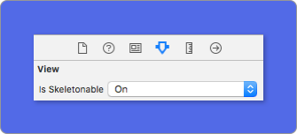

<p align="center">
    <a href="https://github.com/Juanpe/SkeletonView/workflows/build">
      
    </a>
    <a href="https://codebeat.co/projects/github-com-juanpe-skeletonview-master"></a>
    
    
    <a href="https://badge.bow-swift.io/recipe?name=SkeletonView&description=An%20elegant%20way%20to%20show%20users%20that%20something%20is%20happening%20and%20also%20prepare%20them%20to%20which%20contents%20he%20is%20waiting&url=https://github.com/juanpe/skeletonview&owner=Juanpe&avatar=https://avatars0.githubusercontent.com/u/1409041?v=4&tag=1.8.7"></a>   
    <br/>
    <a href="https://twitter.com/JuanpeCatalan">
        
    </a>
    <a href="https://twitter.com/intent/tweet?text=Wow%20This%20library%20is%20awesome:&url=https%3A%2F%2Fgithub.com%2FJuanpe%2FSkeletonView">
      
    </a>
</p>

<br/>
<br/>

**🌎 README is available in other languages: [🇨🇳](https://github.com/Juanpe/SkeletonView/blob/master/README_zh.md) [🇧🇷](https://github.com/Juanpe/SkeletonView/blob/master/README_pt-br.md) [🇰🇷](https://github.com/Juanpe/SkeletonView/blob/master/README_ko.md) [🇫🇷](https://github.com/Juanpe/SkeletonView/blob/master/README_fr.md)**

Today almost all apps have async processes, such as API requests, long running processes, etc. While the processes are working, usually developers place a loading view to show users that something is going on.

```SkeletonView``` has been conceived to address this need, an elegant way to show users that something is happening and also prepare them for which contents are waiting.

Enjoy it! 🙂

* [Features](#-features)
* [Guides](#-guides)
* [Installation](#-installation)
  * [Cocoapods](#using-cocoapods)
  * [Carthage](#using-carthage)
  * [SPM](#using-swift-package-manager)
* [How to use](#-how-to-use)
  * [Collections](#-collections)
  * [Multiline text](#-multiline-text)
  * [Custom colors](#-custom-colors)
  * [Appearance](#-appearance)
  * [Custom animations](#-custom-animations)
  * [Transitions](#-transitions)
  * [Hierarchy](#-hierarchy)
  * [Debug](#-debug)
* [Documentation](#-documentation)
* [Supported OS & SDK Versions](#-supported-os--sdk-versions)
* [Next steps](#-next-steps)
* [Contributing](#%EF%B8%8F-contributing)
* [Mentions](#-mentions)
* [Author](#-author)
* [License](#-license)


## 🌟 Features

- [x] Easy to use
- [x] All UIViews are skeletonables
- [x] Fully customizable
- [x] Universal (iPhone & iPad)
- [x] Interface Builder friendly
- [x] Simple Swift syntax
- [x] Lightweight readable codebase

## 🎬 Guides

| [](https://youtu.be/75kgOhWsPNA)|[](https://youtu.be/MVCiM_VdxVA)|[](https://youtu.be/Qq3Evspeea8)|[](https://youtu.be/ZOoPtBwDRT0)
|:---:  | :---: |:---:  | :---: 
|[**SkeletonView Guides - Getting started**](https://youtu.be/75kgOhWsPNA)|[**How to Create Loading View with Skeleton View in Swift 5.2**](https://youtu.be/MVCiM_VdxVA) <br/> by iKh4ever Studio|[**Create Skeleton Loading View in App (Swift 5) - Xcode 11, 2020**](https://youtu.be/Qq3Evspeea8) <br/> by iOS Academy| [**Add An Elegant Loading Animation in Swift***](https://youtu.be/ZOoPtBwDRT0) <br/> by Gary Tokman

## 📲 Installation

#### Using [CocoaPods](https://cocoapods.org)

Edit your `Podfile` and specify the dependency:

```ruby
pod "SkeletonView"
```

#### Using [Carthage](https://github.com/carthage)

Edit your `Cartfile` and specify the dependency:

```bash
github "Juanpe/SkeletonView"
```

#### Using [Swift Package Manager](https://github.com/apple/swift-package-manager)

Once you have your Swift package set up, adding `SkeletonView` as a dependency is as easy as adding it to the `dependencies` value of your `Package.swift`.

```swift
  dependencies: [
    .package(url: "https://github.com/Juanpe/SkeletonView.git", from: "1.7.0")
  ]
```


## 🐒 How to use

Only **3** steps needed to use `SkeletonView`:

**1.** Import SkeletonView in proper place.
```swift
import SkeletonView
```

**2.** Now, set which views will be `skeletonables`. You achieve this in two ways:

**Using code:**
```swift
avatarImageView.isSkeletonable = true
```
**Using IB/Storyboards:**



**3.** Once you've set the views, you can show the **skeleton**. To do so, you have **4** choices:

```swift
(1) view.showSkeleton()                 // Solid
(2) view.showGradientSkeleton()         // Gradient
(3) view.showAnimatedSkeleton()         // Solid animated
(4) view.showAnimatedGradientSkeleton() // Gradient animated
```

**Preview**

<table>
<tr>
<td width="25%">
<center>Solid</center>
</td>
<td width="25%">
<center>Gradient</center>
</td>
<td width="25%">
<center>Solid Animated</center>
</td>
<td width="25%">
<center>Gradient Animated</center>
</td>
</tr>
<tr>
<td width="25%">
</img>
</td>
<td width="25%">
</img>
</td>
<td width="25%">
</img>
</td>
<td width="25%">
</img>
</td>
</tr>
</table>

> **IMPORTANT!**
>>```SkeletonView``` is recursive, so if you want show the skeleton in all skeletonable views, you only need to call the show method in the main container view. For example, with UIViewControllers

### Extra

#### Skeleton views layout

Sometimes skeleton layout may not fit your layout because the parent view bounds have changed. ~For example, rotating the device.~

You can relayout the skeleton views like so:

```swift
override func viewDidLayoutSubviews() {
    view.layoutSkeletonIfNeeded()
}
```

⚠️⚠️ You shouldn't call this method. From *version 1.8.1* you don't need to call this method, the library does automatically. So, you can use this method *ONLY* in the cases when you need to update the layout of the skeleton manually.

#### Update skeleton configuration

You can change the skeleton configuration at any time like its colour, animation, etc. with the following methods:

```swift
(1) view.updateSkeleton()                 // Solid
(2) view.updateGradientSkeleton()         // Gradient
(3) view.updateAnimatedSkeleton()         // Solid animated
(4) view.updateAnimatedGradientSkeleton() // Gradient animated
```

### 🌿 Collections

```SkeletonView``` is compatible with ```UITableView``` and ```UICollectionView```.

#### UITableView

If you want to show the skeleton in a ```UITableView```, you need to conform to ```SkeletonTableViewDataSource``` protocol.

``` swift
public protocol SkeletonTableViewDataSource: UITableViewDataSource {
    func numSections(in collectionSkeletonView: UITableView) -> Int
    func collectionSkeletonView(_ skeletonView: UITableView, numberOfRowsInSection section: Int) -> Int
    func collectionSkeletonView(_ skeletonView: UITableView, cellIdentifierForRowAt indexPath: IndexPath) -> ReusableCellIdentifier
    func collectionSkeletonView(_ skeletonView: UITableView, identifierForHeaderInSection section: Int) -> ReusableHeaderFooterIdentifier?
    func collectionSkeletonView(_ skeletonView: UITableView, identifierForFooterInSection section: Int) -> ReusableHeaderFooterIdentifier?
}
```
As you can see, this protocol inherits from ```UITableViewDataSource```, so you can replace this protocol with the skeleton protocol.

This protocol has a default implementation:

``` swift
func numSections(in collectionSkeletonView: UITableView) -> Int
// Default: 1
```

``` swift
func collectionSkeletonView(_ skeletonView: UITableView, numberOfRowsInSection section: Int) -> Int
// Default:
// It calculates how many cells need to populate whole tableview
```

``` swift
func collectionSkeletonView(_ skeletonView: UITableView, identifierForHeaderInSection section: Int) -> ReusableHeaderFooterIdentifier?
// Default: nil
```

``` swift
func collectionSkeletonView(_ skeletonView: UITableView, identifierForFooterInSection section: Int) -> ReusableHeaderFooterIdentifier?
// Default: nil
```

There is only one method you need to implement to let Skeleton know the cell identifier. This method doesn't have default implementation:
 ``` swift
 func collectionSkeletonView(_ skeletonView: UITableView, cellIdentifierForRowAt indexPath: IndexPath) -> ReusableCellIdentifier
 ```

**Example**
 ``` swift
 func collectionSkeletonView(_ skeletonView: UITableView, cellIdentifierForRowAt indexPath: IndexPath) -> ReusableCellIdentifier {
    return "CellIdentifier"
}
 ```

> **IMPORTANT!**
> If you are using resizable cells (`tableView.rowHeight = UITableViewAutomaticDimension` ), it's mandatory define the `estimatedRowHeight`.

👩🏼‍🏫  **How specify which elements are skeletonables?**

Here is an illustration that shows how you should specify which elements are skeletonables when you are using an `UITableView`:


As you can see, we have to make skeletonable the tableview, the cell and the UI elements, but we don't need to set as skeletonable the `contentView`

####  UICollectionView

For ```UICollectionView```, you need to conform to ```SkeletonCollectionViewDataSource``` protocol.

``` swift
public protocol SkeletonCollectionViewDataSource: UICollectionViewDataSource {
    func numSections(in collectionSkeletonView: UICollectionView) -> Int
    func collectionSkeletonView(_ skeletonView: UICollectionView, numberOfItemsInSection section: Int) -> Int
    func collectionSkeletonView(_ skeletonView: UICollectionView, cellIdentifierForItemAt indexPath: IndexPath) -> ReusableCellIdentifier
}
```

The rest of the process is the same as ```UITableView```

### 📰 Multiline text


When using elements with text, ```SkeletonView``` draws lines to simulate text.
Besides, you can decide how many lines you want. If  ```numberOfLines``` is set to zero, it will calculate how many lines needed to populate the whole skeleton and it will be drawn. Instead, if you set it to one, two or any number greater than zero, it will only draw this number of lines.

##### 🎛 Customize

You can set some properties for multilines elements.


| Property | Values | Default | Preview
| ------- | ------- |------- | -------
| **Filling percent** of the last line. | `0...100` | `70%` | 
| **Corner radius** of lines. (**NEW**) | `0...10` | `0` | 


To modify the percent or radius **using code**, set the properties:
```swift
descriptionTextView.lastLineFillPercent = 50
descriptionTextView.linesCornerRadius = 5
```

Or, if you prefer use **IB/Storyboard**:


### 🎨 Custom colors

You can decide which color the skeleton is tinted with. You only need to pass as a parameter the color or gradient you want.

**Using solid colors**
``` swift
view.showSkeleton(usingColor: UIColor.gray) // Solid
// or
view.showSkeleton(usingColor: UIColor(red: 25.0, green: 30.0, blue: 255.0, alpha: 1.0))
```
**Using gradients**
``` swift
let gradient = SkeletonGradient(baseColor: UIColor.midnightBlue)
view.showGradientSkeleton(usingGradient: gradient) // Gradient
```

Besides, ```SkeletonView``` features 20 flat colors 🤙🏼

```UIColor.turquoise, UIColor.greenSea, UIColor.sunFlower, UIColor.flatOrange  ...```


###### Image captured from website [https://flatuicolors.com](https://flatuicolors.com)

### 🦋 Appearance

**NEW** The skeletons have a default appearance. So, when you don't specify the color, gradient or multilines properties, `SkeletonView` uses the default values.

Default values:
- **tintColor**: UIColor
    - *default: `.skeletonDefault` (same as `.clouds` but adaptive to dark mode)*
- **gradient**: SkeletonGradient
  - *default: `SkeletonGradient(baseColor: .skeletonDefault)`*
- **multilineHeight**: CGFloat
  - *default: 15*
- **multilineSpacing**: CGFloat
  - *default: 10*
- **multilineLastLineFillPercent**: Int
  - *default: 70*
- **multilineCornerRadius**: Int
  - *default: 0*
- **skeletonCornerRadius**: CGFloat (IBInspectable)  (Make your skeleton view with corner)
  - *default: 0*

To get these default values you can use `SkeletonAppearance.default`. Using this property you can set the values as well:
```Swift
SkeletonAppearance.default.multilineHeight = 20
SkeletonAppearance.default.tintColor = .green
```

You can also specifiy these line appearance properties on a per-label basis:
- **lastLineFillPercent**: Int
- **linesCornerRadius**: Int
- **skeletonLineSpacing**: CGFloat
- **skeletonPaddingInsets**: UIEdgeInsets


### 🤓 Custom animations

```SkeletonView``` has two built-in animations, *pulse* for solid skeletons and *sliding* for gradients.

Besides, if you want to do your own skeleton animation, it's really easy.


Skeleton provides the `showAnimatedSkeleton` function which has a ```SkeletonLayerAnimation``` closure where you can define your custom animation.

```swift
public typealias SkeletonLayerAnimation = (CALayer) -> CAAnimation
```

You can call the function like this:

```swift
view.showAnimatedSkeleton { (layer) -> CAAnimation in
  let animation = CAAnimation()
  // Customize here your animation

  return animation
}
```

It's available ```SkeletonAnimationBuilder```. It's a builder to make ```SkeletonLayerAnimation```.

Today, you can create **sliding animations** for gradients, deciding the **direction** and setting the **duration** of the animation (default = 1.5s).

```swift
// func makeSlidingAnimation(withDirection direction: GradientDirection, duration: CFTimeInterval = 1.5) -> SkeletonLayerAnimation

let animation = SkeletonAnimationBuilder().makeSlidingAnimation(withDirection: .leftToRight)
view.showAnimatedGradientSkeleton(usingGradient: gradient, animation: animation)

```

```GradientDirection``` is an enum, with this cases:

|  Direction | Preview
|------- | -------
| .leftRight | 
| .rightLeft | 
| .topBottom | 
| .bottomTop | 
| .topLeftBottomRight | 
| .bottomRightTopLeft | 

> **😉 TRICK!**
Exist another way to create sliding animations, just using this shortcut:
>>```let animation = GradientDirection.leftToRight.slidingAnimation()```


### 🏄 Transitions

```SkeletonView``` has build-in transitions to **show** or **hide** the skeletons in a *smoother* way 🤙

To use the transition, simply add the ```transition``` parameter to your ```showSkeleton()``` or ```hideSkeleton()``` function with the transition time, like this:

```swift
view.showSkeleton(transition: .crossDissolve(0.25))     //Show skeleton cross dissolve transition with 0.25 seconds fade time
view.hideSkeleton(transition: .crossDissolve(0.25))     //Hide skeleton cross dissolve transition with 0.25 seconds fade time

```

The default value is  `crossDissolve(0.25)`

**Preview**

<table>
<tr>
<td width="50%">
<center>None</center>
</td>
<td width="50%">
<center>Cross dissolve</center>
</td>
</tr>
<tr>
<td width="50%">
</img>
</td>
<td width="50%">
</img>
</td>
</tr>
</table>


### 👨‍👧‍👦 Hierarchy

Since ```SkeletonView``` is recursive, and we want skeleton to be very efficient, we want to stop recursion as soon as possible. For this reason, you must set the container view as `Skeletonable`, because Skeleton will stop looking for `skeletonable` subviews as soon as a view is not Skeletonable, breaking then the recursion.

Because an image is worth a thousand words:

In this example we have a `UIViewController` with a `ContainerView` and a `UITableView`. When the view is ready, we show the skeleton using this method:
```
view.showSkeleton()
```

> ```ìsSkeletonable```= ☠️

| Configuration | Result|
|:-------:|:-------:|
| | |
| | |
| | |
|| |
| | |
| | |


### 🔬 Debug

**NEW** In order to facilitate the debug tasks when something is not working fine. `SkeletonView` has some new tools.

First, `UIView` has available a new property with his skeleton info:
```swift
var skeletonDescription: String

```
The skeleton representation looks like this:


Besides, you can activate the new **debug mode**. You just add the environment variable `SKELETON_DEBUG` and activate it.


Then, when the skeleton appears, you can see the view hierarchy in the Xcode console.

<details>
<summary>Open to see an output example </summary>

</details>


### 📚 Documentation
Coming soon...😅

### 📋 Supported OS & SDK Versions

* iOS 9.0+
* tvOS 9.0+
* Swift 5

## 📬 Next steps

* [x] Set the filling percent of the last line in multiline elements
* [x] Add more gradient animations
* [x] Supported resizable cells
* [x] CollectionView compatible
* [x] tvOS compatible
* [x] Add recovery state
* [x] Custom default appearance
* [x] Debug mode
* [x] Add animations when it shows/hides the skeletons
* [ ] Custom collections compatible
* [ ] MacOS and WatchOS compatible

## ❤️ Contributing
This is an open source project, so feel free to contribute. How?
- Open an [issue](https://github.com/Juanpe/SkeletonView/issues/new).
- Send feedback via [email](mailto://juanpecatalan.com).
- Propose your own fixes, suggestions and open a pull request with the changes.

See [all contributors](https://github.com/Juanpe/SkeletonView/graphs/contributors)

###### Project generated with [SwiftPlate](https://github.com/JohnSundell/SwiftPlate)

## 📢 Mentions

- [iOS Dev Weekly #327](https://iosdevweekly.com/issues/327#start)
- [Hacking with Swift Articles](https://www.hackingwithswift.com/articles/40/skeletonview-makes-loading-content-beautiful)
- [Top 10 Swift Articles November](https://medium.mybridge.co/swift-top-10-articles-for-the-past-month-v-nov-2017-dfed7861cd65)
- [30 Amazing iOS Swift Libraries (v2018)](https://medium.mybridge.co/30-amazing-ios-swift-libraries-for-the-past-year-v-2018-7cf15027eee9)
- [AppCoda Weekly #44](http://digest.appcoda.com/issues/appcoda-weekly-issue-44-81899)
- [iOS Cookies Newsletter #103](https://us11.campaign-archive.com/?u=cd1f3ed33c6527331d82107ba&id=48131a516d)
- [Swift Developments Newsletter #113](https://andybargh.com/swiftdevelopments-113/)
- [iOS Goodies #204](http://ios-goodies.com/post/167557280951/week-204)
- [Swift Weekly #96](http://digest.swiftweekly.com/issues/swift-weekly-issue-96-81759)
- [CocoaControls](https://www.cocoacontrols.com/controls/skeletonview)
- [Awesome iOS Newsletter #74](https://ios.libhunt.com/newsletter/74)
- [Swift News #36](https://www.youtube.com/watch?v=mAGpsQiy6so)
- [Best iOS articles, new tools & more](https://medium.com/flawless-app-stories/best-ios-articles-new-tools-more-fcbe673e10d)


## 👨🏻‍💻 Author
[1.1]: http://i.imgur.com/tXSoThF.png
[1]: http://www.twitter.com/JuanpeCatalan

* Juanpe Catalán [![alt text][1.1]][1]

<a class="bmc-button" target="_blank" href="https://www.buymeacoffee.com/CDou4xtIK"><span style="margin-left:5px"></span></a>

## 👮🏻 License

```
MIT License

Copyright (c) 2017 Juanpe Catalán

Permission is hereby granted, free of charge, to any person obtaining a copy
of this software and associated documentation files (the "Software"), to deal
in the Software without restriction, including without limitation the rights
to use, copy, modify, merge, publish, distribute, sublicense, and/or sell
copies of the Software, and to permit persons to whom the Software is
furnished to do so, subject to the following conditions:

The above copyright notice and this permission notice shall be included in all
copies or substantial portions of the Software.

THE SOFTWARE IS PROVIDED "AS IS", WITHOUT WARRANTY OF ANY KIND, EXPRESS OR
IMPLIED, INCLUDING BUT NOT LIMITED TO THE WARRANTIES OF MERCHANTABILITY,
FITNESS FOR A PARTICULAR PURPOSE AND NONINFRINGEMENT. IN NO EVENT SHALL THE
AUTHORS OR COPYRIGHT HOLDERS BE LIABLE FOR ANY CLAIM, DAMAGES OR OTHER
LIABILITY, WHETHER IN AN ACTION OF CONTRACT, TORT OR OTHERWISE, ARISING FROM,
OUT OF OR IN CONNECTION WITH THE SOFTWARE OR THE USE OR OTHER DEALINGS IN THE
SOFTWARE.
```
