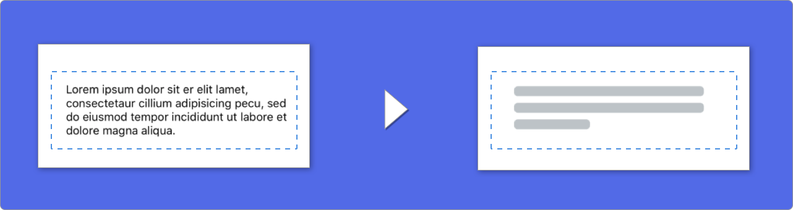

<p align="center">
    <a href="https://github.com/Juanpe/SkeletonView/actions?query=workflow%3ACI">
      
    </a>
    <a href="https://codebeat.co/projects/github-com-juanpe-skeletonview-master"></a>
    
    
    <a href="https://badge.bow-swift.io/recipe?name=SkeletonView&description=An%20elegant%20way%20to%20show%20users%20that%20something%20is%20happening%20and%20also%20prepare%20them%20to%20which%20contents%20he%20is%20waiting&url=https://github.com/juanpe/skeletonview&owner=Juanpe&avatar=https://avatars0.githubusercontent.com/u/1409041?v=4&tag=1.8.7"></a>   
</p>

<p align="center">
    <a href="#-destacado">Destacado</a>
  • <a href="#-instalación">Instalación</a>
  • <a href="#-cómo-funciona">¿Cómo funciona?</a>
  • <a href="#-miscelánea">Miscelánea</a>
  • <a href="#️-contribuir">Contribuir</a>
</p>

**🌎 README está disponible en estos idiomas: [🇬🇧](https://github.com/Juanpe/SkeletonView/blob/master/README.md) . [🇨🇳](https://github.com/Juanpe/SkeletonView/blob/master/README_zh.md) . [🇧🇷](https://github.com/Juanpe/SkeletonView/blob/master/README_pt-br.md) . [🇰🇷](https://github.com/Juanpe/SkeletonView/blob/master/README_ko.md) . [🇫🇷](https://github.com/Juanpe/SkeletonView/blob/master/README_fr.md)**

Hoy en día, La mayoría de las apps tiene procesos asíncronos, como peticiones a una API, procesos que tardan mucho tiempo, etc. Mientras estos procesos se están ejecutando, se suele mostrar un aburrido spinner indicando que algo está pasando.

**SkeletonView** ha sido desarrollada para cubrir esta necesidad, un elegante manera de decirle a los usarios que algo se está procesando y además prepararlos, visualmente, para el contenido que están esperando.

Enjoy it! 🙂

## 
- [🌟 Destacado](#-destacado)
- [🎬 Videotutoriales](#-videotutoriales)
- [📲 Instalación](#-instalación)
- [🐒 ¿Cómo funciona?](#-cómo-funciona)
- [](#-1)
  - [🌿 Colecciones](#-colecciones)
  - [🔠 Textos](#-textos)
  - [🦋 Apariencia](#-apariencia)
  - [🎨 Colores](#-colores)
        - [Imagen extraída de la web https://flatuicolors.com](#imagen-extraída-de-la-web-httpsflatuicolorscom)
  - [🏃‍♀️ Animaciones](#️-animaciones)
  - [🏄 Transiciones](#-transiciones)
- [✨ Miscelánea](#-miscelánea)
- [❤️ Contributing](#️-contributing)
- [📢 Menciones](#-menciones)
- [👨🏻‍💻 Autor](#-autor)
- [👮🏻 Licencia](#-licencia)


## 🌟 Destacado

* Fácil de usar
* Todas las UIViews son skeletonables
* Personalizable
* Universal (iPhone & iPad)
* Interface Builder friendly


## 🎬 Videotutoriales

| [](https://youtu.be/75kgOhWsPNA)|[](https://youtu.be/MVCiM_VdxVA)|[](https://youtu.be/Qq3Evspeea8)|[](https://youtu.be/ZOoPtBwDRT0)
|:---:  | :---: |:---:  | :---: 
|[**SkeletonView Guides - Getting started**](https://youtu.be/75kgOhWsPNA)|[**How to Create Loading View with Skeleton View in Swift 5.2**](https://youtu.be/MVCiM_VdxVA)    by iKh4ever Studio|[**Create Skeleton Loading View in App (Swift 5) - Xcode 11, 2020**](https://youtu.be/Qq3Evspeea8)    by iOS Academy| [**Add An Elegant Loading Animation in Swift***](https://youtu.be/ZOoPtBwDRT0)    by Gary Tokman


## 📲 Instalación

* [CocoaPods](https://guides.cocoapods.org/using/using-cocoapods.html):

```ruby
pod 'SkeletonView'
```

* [Carthage](https://github.com/Carthage/Carthage):

```ruby
github "Juanpe/SkeletonView"
```

* [Swift Package Manager](https://swift.org/package-manager/):

```swift
dependencies: [
  .package(url: "https://github.com/Juanpe/SkeletonView.git", from: "1.7.0")
]
```


## 🐒 ¿Cómo funciona?

Solo necesitas **3** pasos para usar `SkeletonView`:

1️⃣ Importa SkeletonView en el archivo donde vayas a utilizarlo.
```swift
import SkeletonView
```

2️⃣ Ahora, debes indicar qué elementos de tu vista son `skeletonables`

**Con código:**
```swift
avatarImageView.isSkeletonable = true
```
**Con IB/Storyboards:**


3️⃣ Una vez indicado, solo tienes que mostrar el **skeleton**. Tienes **4** opciones:

```swift
(1) view.showSkeleton()                 // Sólido
(2) view.showGradientSkeleton()         // Degradado
(3) view.showAnimatedSkeleton()         // Sólido animado
(4) view.showAnimatedGradientSkeleton() // Degradado animado
```

**Vista previa**

<table>
<tr>
<td width="25%">
<center>Sólido</center>
</td>
<td width="25%">
<center>Degradado</center>
</td>
<td width="25%">
<center>Sólido Animado</center>
</td>
<td width="25%">
<center>Degradado Animado</center>
</td>
</tr>
<tr>
<td width="25%">
</img>
</td>
<td width="25%">
</img>
</td>
<td width="25%">
</img>
</td>
<td width="25%">
</img>
</td>
</tr>
</table>


> 📣 **¡IMPORTANTE!** 
>
> `SkeletonView` es recursivo. Por lo que si tienes una vsita que contiene varios elementos skeletonables, solo tienes queenecu For example, with `UIViewControllers`.

  
## 
### 🌿 Colecciones

`SkeletonView` es compatible con `UITableView` and `UICollectionView`.


**UITableView**

Si quieres mostrar el skeleton en un `UITableView`, necesitas conformar el protocolo `SkeletonTableViewDataSource`. 

``` swift
public protocol SkeletonTableViewDataSource: UITableViewDataSource {
    // Por defecto: 1
    func numSections(in collectionSkeletonView: UITableView) -> Int

    // Por defecto:
    // Calcula cuantas celdas necesita para rellenar todo el frame.
    func collectionSkeletonView(_ skeletonView: UITableView, numberOfRowsInSection section: Int) -> Int

    func collectionSkeletonView(_ skeletonView: UITableView, cellIdentifierForRowAt indexPath: IndexPath) -> ReusableCellIdentifier
}
```

Este protocolo hereda de `UITableViewDataSource`, por lo que puedes reemplazar este protocolo por el protocolo de skeleton sin perder ninguna funcionalidad. El único método que es obligatorio implementar es `cellIdentifierForRowAt`, donde tienes que indicar el identificador de la celda.

**Ejemplo**
 ``` swift
 func collectionSkeletonView(_ skeletonView: UITableView, cellIdentifierForRowAt indexPath: IndexPath) -> ReusableCellIdentifier {
    return "CellIdentifier"
}
 ```
 
Además, tu puedes mostrar el skeleton en las headers y en los footers, conformando el protocolo `SkeletonTableViewDelegate`.

```swift
public protocol SkeletonTableViewDelegate: UITableViewDelegate {
    func collectionSkeletonView(_ skeletonView: UITableView, identifierForHeaderInSection section: Int) -> ReusableHeaderFooterIdentifier? // default: nil
    func collectionSkeletonView(_ skeletonView: UITableView, identifierForFooterInSection section: Int) -> ReusableHeaderFooterIdentifier? // default: nil
}
```

> 📣 **¡IMPORTANTE!** 
> 
> 1️⃣ Si estás usando celdas con altura dinámica (**`tableView.rowHeight = UITableViewAutomaticDimension`**), es obligatorio definir el **`estimatedRowHeight`**.
> 
> 2️⃣ Cuando añades elemetos a una **`UITableViewCell`**, debes añadirlo al **`contentView`** y no a la celda directamente.
> ```swift
> cell.contentView.addSubview(titleLabel) ✅         
> cell.addSubview(titleLabel) ❌
> ```

  

**UICollectionView**

Para los `UICollectionView`, debes conformar el protocolo `SkeletonCollectionViewDataSource`.

``` swift
public protocol SkeletonCollectionViewDataSource: UICollectionViewDataSource {
    func numSections(in collectionSkeletonView: UICollectionView) -> Int // Por defecto: 1
    func collectionSkeletonView(_ skeletonView: UICollectionView, numberOfItemsInSection section: Int) -> Int
    func collectionSkeletonView(_ skeletonView: UICollectionView, cellIdentifierForItemAt indexPath: IndexPath) -> ReusableCellIdentifier
    func collectionSkeletonView(_ skeletonView: UICollectionView, supplementaryViewIdentifierOfKind: String, at indexPath: IndexPath) -> ReusableCellIdentifier? // Por defecto: nil
}
```

El resto del proceso es exactamente igual que con las `UITableView`.


### 🔠 Textos



Cuando usas elementos que contienen texto,`SkeletonView` dibujo líneas para simular el texto.

Además, puedes decidir el número de líneas. Si  `numberOfLines` es igual a **0**, se calculará automáticamente el número de líneas necesarias para ocupar todo el frame. Sin embargo, si es un número mayor que cero, solo se dibujarán esas líneas.

Puedes especificar algunos atributos para estos elementos:


| Atributo | Valores | Por defecto | Vista previa
| ------- | ------- |------- | -------
| **Porcentaje de relleno** de la última línea. | `0...100` | `70%` | 
| **Radio de las esquinas** de las líneas. | `0...10` | `0` | 

Para modificar alguno de los valores lo puedes hacer **con código**::
```swift
descriptionTextView.lastLineFillPercent = 50
descriptionTextView.linesCornerRadius = 5
```

O usando **IB/Storyboards**:


### 🦋 Apariencia

Los skeletons tiene una apariencia por defecto. Así, cuando no especificas el color, el degradado o las propiedades para las multiíneas, `SkeletonView` usa estos valores.

Valores por defecto:
- **tintColor**: `UIColor`
    - *default: `.skeletonDefault` (igual que `.clouds` pero se adapta al dark mode)*
- **gradient**: `SkeletonGradient`
  - *default: `SkeletonGradient(baseColor: .skeletonDefault)`*
- **multilineHeight**: `CGFloat`
  - *default: 15*
- **multilineSpacing**: `CGFloat`
  - *default: 10*
- **multilineLastLineFillPercent**: `Int`
  - *default: 70*
- **multilineCornerRadius**: `Int`
  - *default: 0*
- **skeletonCornerRadius**: `CGFloat` (IBInspectable)
  - *default: 0*

Para obtener o modificar estos valores tu puedes usar `SkeletonAppearance.default`:
```swift
SkeletonAppearance.default.multilineHeight = 20
SkeletonAppearance.default.tintColor = .green
```


### 🎨 Colores

Puedes decidir de qué color se tinta tu skeleton. Solo tienes que indicarlo pasándolo como parámetro:

**Usando colores sólidos**
```swift
view.showSkeleton(usingColor: UIColor.gray)
// o
view.showSkeleton(usingColor: UIColor(red: 25.0, green: 30.0, blue: 255.0, alpha: 1.0))
```
**Usando degradados**
``` swift
let gradient = SkeletonGradient(baseColor: UIColor.midnightBlue)
view.showGradientSkeleton(usingGradient: gradient)
```

Además, **SkeletonView** añade 20 colores flat 🤙🏼

```UIColor.turquoise, UIColor.greenSea, UIColor.sunFlower, UIColor.flatOrange  ...```


###### Imagen extraída de la web [https://flatuicolors.com](https://flatuicolors.com)


### 🏃‍♀️ Animaciones

**SkeletonView** tiene pre-definidas dos animaciones, *pulse* para skeleton sólidos y *sliding* para degradados.

Además, usando el método `showAnimatedSkeleton`, podemos incluir la `animation` que es de tipo `SkeletonLayerAnimation`, un bloque donde tu puedes crear tus propias animaciones:

```swift
public typealias SkeletonLayerAnimation = (CALayer) -> CAAnimation
```

Tu código quedaría así:

```swift
view.showAnimatedSkeleton { (layer) -> CAAnimation in
  let animation = CAAnimation()
  // Personaliza la animación aquí

  return animation
}
```

`SkeletonAnimationBuilder` es un builder que permite crear `SkeletonLayerAnimation`.

Por ejemplo, tu puedes crear **sliding animations** para los degradados, decidiendo la **direction** y indicando la **duration** de la animación (default = 1.5s).

```swift
// func makeSlidingAnimation(withDirection direction: GradientDirection, duration: CFTimeInterval = 1.5) -> SkeletonLayerAnimation

let animation = SkeletonAnimationBuilder().makeSlidingAnimation(withDirection: .leftToRight)
view.showAnimatedGradientSkeleton(usingGradient: gradient, animation: animation)

```

```GradientDirection``` es un enumerado con estos `cases`:

|  Dirección | Vista previa
|------- | -------
| .leftRight | 
| .rightLeft | 
| .topBottom | 
| .bottomTop | 
| .topLeftBottomRight | 
| .bottomRightTopLeft | 

> **😉 ¡Truco!**
>
> Puedes crear una animación sliding, con este shortcut:
> ```swift
> let animation = GradientDirection.leftToRight.slidingAnimation()
> ```

  

### 🏄 Transiciones

**SkeletonView** tiene algunas transiciones listas para usarse cuando **aparece** o se **oculta**. Puedes especificarla así:

```swift
view.showSkeleton(transition: .crossDissolve(0.25))
view.hideSkeleton(transition: .crossDissolve(0.25))

```

La transición por defecto es `crossDissolve(0.25)`

**Vista previa**

<table>
<tr>
<td width="50%">
<center>Sin transición</center>
</td>
<td width="50%">
<center>Cross dissolve</center>
</td>
</tr>
<tr>
<td width="50%">
</img>
</td>
<td width="50%">
</img>
</td>
</tr>
</table>


## ✨ Miscelánea 

  

**Jerarquía**


`SkeletonView` es recursivo, pero para que sea eficiente, tenemos que pararar la recursión tan pronto como sea posible. Por este motivo, el contenedor de las vistas debe ser **`skeletonable`**, porque `SkeletonView` parará de buscar vistas skeletonables cuando encuentre una que no lo sea, dentro de la jerarquía.

Como una imagen vale más que mil palabras:

En este ejemplo, tenemos un `UIViewController` con un `containerView` y una `UITableView`. Cuando la vista está lista, para mostrar el skeleton ejecutamos el método: 
```
view.showSkeleton()
```

> `isSkeletonable`= ☠️

| Configuración | Resultado|
|:-------:|:-------:|
| | |
| | |
| | |
|| |
| | |
| | |

  

**Jerarquía en las colecciones**

Esta ilustración muestra como deberías específicar qué elementos son skeletonables cuando estás usando una `UITableView`:


**Actualiza el skeleton**

Puedes cambiar la configuración del skeleton, como el color, la animación, etc, con los siguientes métodos:

```swift
(1) view.updateSkeleton()                 // Sólido
(2) view.updateGradientSkeleton()         // Degradado
(3) view.updateAnimatedSkeleton()         // Sólido animado
(4) view.updateAnimatedGradientSkeleton() // Degradado animado
```


**Debug**

Para facilitar las tareas de debug cuando algo no está funcionando bien, **`SkeletonView`** tiene una nueva herramienta.

Primero, `UIView` tiene una nueva propiedad que contiene toda la info del skeleton:
```swift
var skeletonDescription: String

```
Y es representada de la siguiente manera:


Para activar el **modo debug**. Solo tienes que añadir una variable de entorno con esta clave `SKELETON_DEBUG` y activarla.


Entonces, cuando el skeleton aparece, tu podrás ver la jerarquía de vistas en la consola de Xcode.

<details>
<summary>Abre para ver un ejemplo </summary>

</details>

  
  **OS Soportado & Versiones SDK**

* iOS 9.0+
* tvOS 9.0+
* Swift 5


## ❤️ Contributing

Esto es un proyecto open source, siéntete libre de contribuir. ¿Cómo?
- Abre un [issue](https://github.com/Juanpe/SkeletonView/issues/new).
- Envía feedback a través del [email](mailto://juanpecatalan.com).
- Propone tus propies fixes, sugerencias y abre una Pull Request con los cambios.

Échale un vistazo a [los que ya han contribuído](https://github.com/Juanpe/SkeletonView/graphs/contributors)

Para más información, por favor, lee la [guía de contribución](https://github.com/Juanpe/SkeletonView/blob/develop/CONTRIBUTING.md).


## 📢 Menciones

- [iOS Dev Weekly #327](https://iosdevweekly.com/issues/327#start)
- [Hacking with Swift Articles](https://www.hackingwithswift.com/articles/40/skeletonview-makes-loading-content-beautiful)
- [Top 10 Swift Articles November](https://medium.mybridge.co/swift-top-10-articles-for-the-past-month-v-nov-2017-dfed7861cd65)
- [30 Amazing iOS Swift Libraries (v2018)](https://medium.mybridge.co/30-amazing-ios-swift-libraries-for-the-past-year-v-2018-7cf15027eee9)
- [AppCoda Weekly #44](http://digest.appcoda.com/issues/appcoda-weekly-issue-44-81899)
- [iOS Cookies Newsletter #103](https://us11.campaign-archive.com/?u=cd1f3ed33c6527331d82107ba&id=48131a516d)
- [Swift Developments Newsletter #113](https://andybargh.com/swiftdevelopments-113/)
- [iOS Goodies #204](http://ios-goodies.com/post/167557280951/week-204)
- [Swift Weekly #96](http://digest.swiftweekly.com/issues/swift-weekly-issue-96-81759)
- [CocoaControls](https://www.cocoacontrols.com/controls/skeletonview)
- [Awesome iOS Newsletter #74](https://ios.libhunt.com/newsletter/74)
- [Swift News #36](https://www.youtube.com/watch?v=mAGpsQiy6so)
- [Best iOS articles, new tools & more](https://medium.com/flawless-app-stories/best-ios-articles-new-tools-more-fcbe673e10d)


## 👨🏻‍💻 Autor

[Juanpe Catalán](http://www.twitter.com/JuanpeCatalan)

<a class="bmc-button" target="_blank" href="https://www.buymeacoffee.com/CDou4xtIK"><span style="margin-left:5px"></span></a>


## 👮🏻 Licencia

```
MIT License

Copyright (c) 2017 Juanpe Catalán

Permission is hereby granted, free of charge, to any person obtaining a copy
of this software and associated documentation files (the "Software"), to deal
in the Software without restriction, including without limitation the rights
to use, copy, modify, merge, publish, distribute, sublicense, and/or sell
copies of the Software, and to permit persons to whom the Software is
furnished to do so, subject to the following conditions:

The above copyright notice and this permission notice shall be included in all
copies or substantial portions of the Software.

THE SOFTWARE IS PROVIDED "AS IS", WITHOUT WARRANTY OF ANY KIND, EXPRESS OR
IMPLIED, INCLUDING BUT NOT LIMITED TO THE WARRANTIES OF MERCHANTABILITY,
FITNESS FOR A PARTICULAR PURPOSE AND NONINFRINGEMENT. IN NO EVENT SHALL THE
AUTHORS OR COPYRIGHT HOLDERS BE LIABLE FOR ANY CLAIM, DAMAGES OR OTHER
LIABILITY, WHETHER IN AN ACTION OF CONTRACT, TORT OR OTHERWISE, ARISING FROM,
OUT OF OR IN CONNECTION WITH THE SOFTWARE OR THE USE OR OTHER DEALINGS IN THE
SOFTWARE.
```
