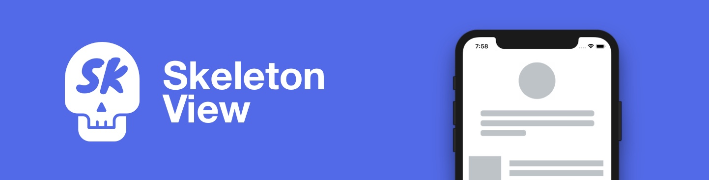
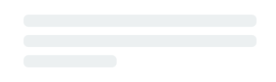
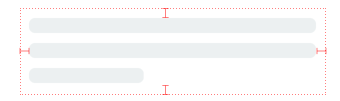
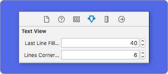

<p align="center">
    <a href="https://github.com/Juanpe/SkeletonView/actions?query=workflow%3ACI">
      
    </a>
    <a href="https://codebeat.co/projects/github-com-juanpe-skeletonview-main"></a>
    <a href="https://cocoapods.org/pods/SkeletonView"></a>
    <a href="https://github.com/Carthage/Carthage/"></a>
    <a href="https://swift.org/package-manager/"></a>
    
    <a href="https://badge.bow-swift.io/recipe?name=SkeletonView&description=An%20elegant%20way%20to%20show%20users%20that%20something%20is%20happening%20and%20also%20prepare%20them%20to%20which%20contents%20he%20is%20waiting&url=https://github.com/juanpe/skeletonview&owner=Juanpe&avatar=https://avatars0.githubusercontent.com/u/1409041?v=4&tag=1.20.0"></a>   
</p>

<p align="center">
    <a href="#-funktionen">Funktionen</a>
  • <a href="#-anleitungen">Anleitungen</a>
  • <a href="#-installation">Installation</a>
  • <a href="#-verwendung">Verwendung</a>
  • <a href="#-sonstiges">Sonstiges</a>
  • <a href="#️-beitragen">Beitragen</a>
</p>

**🌎 README ist auch in anderen Sprachen verfügbar: [🇬🇧](../README.md) . [🇪🇸](README_es.md) . [🇨🇳](README_zh.md) . [🇧🇷](README_pt-br.md) . [🇰🇷](README_ko.md) . [🇫🇷](README_fr.md)**

Heutzutage haben fast alle Anwendungen async-Prozesse, z.B. API-Anfragen, lang laufende Prozesse, usw. Während die Prozesse arbeiten, platzieren die Entwickler in der Regel eine Ladeansicht, um den Benutzern zu zeigen, dass im Hintergrund etwas vor sich geht.

**SkeletonView** wurde entwickelt, um dieses Bedürfnis zu befriedigen, indem auf eine elegante Art und Weise, den Nutzern gezeigt wird, dass etwas passiert und sie gleichzeitig darauf vorbereitet, welche Inhalte sie erwarten.

Viel Spaß damit! 🙂


##
- [🌟 Funktionen](#-funktionen)
- [🎬 Anleitungen](#-anleitungen)
- [📲 Installation](#-installation)
- [🐒 Verwendung](#-verwendung)
  - [🌿 Sammlungen](#-sammlungen)
  - [🔠 Texte](#-texte)
  - [🦋 Erscheinungsbild](#-erscheinungsbild)
  - [🎨 Benutzerdefinierte Farben](#-benutzerdefinierte-farben)
  - [🏃‍♀️ Animationen](#️-animationen)
  - [🏄 Übergänge](#-übergänge)
- [✨ Sonstiges](#-sonstiges)
- [❤️ Beitragen](#️-beitragen)
- [📢 Erwähnungen](#-erwähnungen)
- [🏆 Sponsoren](#-sponsoren)
- [👨🏻‍💻 Autor](#-autor)
- [👮🏻 Lizenz](#-lizenz)


## 🌟 Funktionen

* Einfach zu benutzen
* Alle UIViews sind skelettierbar
* Vollständig anpassbar
* Universal (iPhone & iPad)
* Freundlicher interface builder
* Einfache Swift-Syntax
* Leicht lesbarer code


## 🎬 Anleitungen

| [](https://youtu.be/75kgOhWsPNA)|[](https://youtu.be/MVCiM_VdxVA)|[](https://youtu.be/Qq3Evspeea8)|[](https://www.youtube.com/watch?v=Zx1Pg1gPfxA)
|:---:  | :---:  | :---: | :---:
|[**SkeletonView Guides - Getting started**](https://youtu.be/75kgOhWsPNA)|[**How to Create Loading View with Skeleton View in Swift 5.2**](https://youtu.be/MVCiM_VdxVA)    by iKh4ever Studio|[**Create Skeleton Loading View in App (Swift 5) - Xcode 11, 2020**](https://youtu.be/Qq3Evspeea8)    by iOS Academy| [**Cómo crear una ANIMACIÓN de CARGA de DATOS en iOS**](https://www.youtube.com/watch?v=Zx1Pg1gPfxA) by MoureDev


## 📲 Installation

* [CocoaPods](https://guides.cocoapods.org/using/using-cocoapods.html):

```ruby
pod 'SkeletonView'
```

* [Carthage](https://github.com/Carthage/Carthage):

```ruby
github "Juanpe/SkeletonView"
```

* [Swift Package Manager](https://swift.org/package-manager/):

```swift
dependencies: [
  .package(url: "https://github.com/Juanpe/SkeletonView.git", from: "1.7.0")
]
```

> 📣 **WICHTIG!** 
>
> Seit Version 1.30.0 unterstützt `SkeletonView` **XCFrameworks**, wenn sie es also als **XCFramework** installieren möchten, verwenden sie bitte stattdessen [dieses Repo](https://github.com/Juanpe/SkeletonView-XCFramework.git).


## 🐒 Verwendung

Nur **3** Schritte sind erforderlich, um `SkeletonView` zu verwenden:

1️⃣ Importieren sie SkeletonView an der richtigen Stelle.
```swift
import SkeletonView
```

2️⃣ Legen sie nun fest, welche Ansichten `skelettierbar` sein sollen. Dies können sie auf zwei Arten erreichen:

**Durch code:**
```swift
avatarImageView.isSkeletonable = true
```
**Durch IB/Storyboards:**


3️⃣ Sobald sie die Views eingestellt haben, können sie das **Skelett** anzeigen. Dazu haben sie **4** Auswahlmöglichkeiten:

```swift
(1) view.showSkeleton()                 // Einfarbig
(2) view.showGradientSkeleton()         // Farbverlauf
(3) view.showAnimatedSkeleton()         // Einfarbig animiert
(4) view.showAnimatedGradientSkeleton() // Farbverlauf animiert
```

**Vorschau**

<table>
<tr>
<td width="25%">
<center>Einfarbig</center>
</td>
<td width="25%">
<center>Farbverlauf</center>
</td>
<td width="25%">
<center>Einfarbig animiert</center>
</td>
<td width="25%">
<center>Farbverlauf animiert</center>
</td>
</tr>
<tr>
<td width="25%">
</img>
</td>
<td width="25%">
</img>
</td>
<td width="25%">
</img>
</td>
<td width="25%">
</img>
</td>
</tr>
</table>

> 📣 **WICHTIG!** 
>
> `SkeletonView` ist rekursiv, wenn sie also das Skelett in allen skelettierbaren Views anzeigen wollen, müssen sie nur die show-Methode in der Haupt-Container-View aufrufen. Zum Beispiel mit `UIViewControllers`.

  


### 🌿 Sammlungen

```SkeletonView``` ist kompatibel mit ```UITableView``` und ```UICollectionView```.


**UITableView**

Wenn sie das Skelett in eines ```UITableView```'s anzeigen wollen, müssen dieses dem ```SkeletonTableViewDataSource```-Protokoll entsprechen.

``` swift
public protocol SkeletonTableViewDataSource: UITableViewDataSource {
    func numSections(in collectionSkeletonView: UITableView) -> Int // Standard: 1
    func collectionSkeletonView(_ skeletonView: UITableView, numberOfRowsInSection section: Int) -> Int
    func collectionSkeletonView(_ skeletonView: UITableView, cellIdentifierForRowAt indexPath: IndexPath) -> ReusableCellIdentifier
    func collectionSkeletonView(_ skeletonView: UITableView, skeletonCellForRowAt indexPath: IndexPath) -> UITableViewCell? // Standard: nil
    func collectionSkeletonView(_ skeletonView: UITableView, prepareCellForSkeleton cell: UITableViewCell, at indexPath: IndexPath)
}
```
Wie sie sehen können, erbt dieses Protokoll von ```UITableViewDataSource```, so dass sie dieses Protokoll durch das Skelettprotokoll ersetzen können.

Dieses Protokoll hat eine Standardimplementierung für einige Methoden. Zum Beispiel wird die Anzahl der Zeilen für jeden Abschnitt in Echtzeit berechnet:

``` swift
func collectionSkeletonView(_ skeletonView: UITableView, numberOfRowsInSection section: Int) -> Int
// Standard:
// Es wird berechnet, wie viele Zellen benötigt werden, um die gesamte Tabellenansicht zu füllen
```

> 📣 **WICHTIG!** 
>
> Wenn sie in der obigen Methode `UITableView.automaticNumberOfSkeletonRows` zurückgeben, verhält es sich wie das Standardverhalten (d.h. es wird berechnet, wie viele Zellen benötigt werden, um den gesamten Tableview zu füllen).

Es gibt nur eine Methode, die sie implementieren müssen, damit Skeleton den Zellen ID kennt. Diese Methode hat keine Standardimplementierung:
 ``` swift
 func collectionSkeletonView(_ skeletonView: UITableView, cellIdentifierForRowAt indexPath: IndexPath) -> ReusableCellIdentifier {
    return "CellIdentifier"
}
 ```
Standardmäßig entfernt die library die Zellen aus jedem indexPath, aber sie können dies auch tun, wenn sie einige Änderungen vornehmen möchten, bevor das Skelett erscheint:
``` swift
 func collectionSkeletonView(_ skeletonView: UITableView, skeletonCellForRowAt indexPath: IndexPath) -> UITableViewCell? {
     let cell = skeletonView.dequeueReusableCell(withIdentifier: "CellIdentifier", for: indexPath) as? Cell
     cell?.textField.isHidden = indexPath.row == 0
     return cell
 }
 ```
 
Wenn sie es vorziehen, den deque-Teil der Bibliothek zu überlassen, können sie die Zelle mit dieser Methode konfigurieren:
 ``` swift
 func collectionSkeletonView(_ skeletonView: UITableView, prepareCellForSkeleton cell: UITableViewCell, at indexPath: IndexPath) {
     let cell = cell as? Cell
     cell?.textField.isHidden = indexPath.row == 0
 }
 ```

Außerdem können sie sowohl die Kopf- als auch die Fußzeilen skelettieren. Diese müssen nur dem Protokoll "SkeletonTableViewDelegate" entsprechen.

```swift
public protocol SkeletonTableViewDelegate: UITableViewDelegate {
    func collectionSkeletonView(_ skeletonView: UITableView, identifierForHeaderInSection section: Int) -> ReusableHeaderFooterIdentifier? // standard: nil
    func collectionSkeletonView(_ skeletonView: UITableView, identifierForFooterInSection section: Int) -> ReusableHeaderFooterIdentifier? // standard: nil
}
```

> 📣 **WICHTIG!**
> 
> 1️⃣ Wenn sie größenvariable Zellen verwenden (**`tableView.rowHeight = UITableViewAutomaticDimension`**), ist es zwingend erforderlich, die **`estimatedRowHeight`** zu definieren.
> 
> 2️⃣ Wenn man Elemente in einer **`UITableViewCell`** hinzufügt, sollte man sie dem **`contentView`** hinzufügen und nicht direkt in der Zelle.
> ```swift
> self.contentView.addSubview(titleLabel) ✅         
> self.addSubview(titleLabel) ❌
> ```

  

**UICollectionView**

Für `UICollectionView` müssen sie dem Protokoll `SkeletonCollectionViewDataSource` entsprechen.

``` swift
public protocol SkeletonCollectionViewDataSource: UICollectionViewDataSource {
    func numSections(in collectionSkeletonView: UICollectionView) -> Int  // standard: 1
    func collectionSkeletonView(_ skeletonView: UICollectionView, numberOfItemsInSection section: Int) -> Int
    func collectionSkeletonView(_ skeletonView: UICollectionView, cellIdentifierForItemAt indexPath: IndexPath) -> ReusableCellIdentifier
    func collectionSkeletonView(_ skeletonView: UICollectionView, supplementaryViewIdentifierOfKind: String, at indexPath: IndexPath) -> ReusableCellIdentifier? // standard: nil
    func collectionSkeletonView(_ skeletonView: UICollectionView, skeletonCellForItemAt indexPath: IndexPath) -> UICollectionViewCell?  // standard: nil
    func collectionSkeletonView(_ skeletonView: UICollectionView, prepareCellForSkeleton cell: UICollectionViewCell, at indexPath: IndexPath)
    func collectionSkeletonView(_ skeletonView: UICollectionView, prepareViewForSkeleton view: UICollectionReusableView, at indexPath: IndexPath)
}
```

Der Rest des Prozesses ist derselbe wie bei ```UITableView```


### 🔠 Texte


Wenn Elemente mit Text verwendet werden, zeichnet ```SkeletonView``` Linien, um Text zu simulieren.

Sie können einige Variablen für mehrzeilige Elemente einstellen.

| Variable | Typ | Standard | Vorschau
| ------- | ------- |------- | -------
| **lastLineFillPercent**  | `CGFloat` | `70`| 
| **linesCornerRadius**  | `Int` | `0` | 
| **skeletonLineSpacing**  | `CGFloat` | `10` | 
| **skeletonPaddingInsets**  | `UIEdgeInsets` | `.zero` | 
| **skeletonTextLineHeight**  | `SkeletonTextLineHeight` | `.fixed(15)` | 
| **skeletonTextNumberOfLines**  | `SkeletonTextNumberOfLines` | `.inherited` | 

<br />

Um den Prozentsatz oder den Radius **mit Hilfe von Code** zu ändern, legen sie diese Variablen fest:
```swift
descriptionTextView.lastLineFillPercent = 50
descriptionTextView.linesCornerRadius = 5
```

Oder, wenn sie es vorziehen, verwenden sie **IB/Storyboard**:



<br />

**Wie kann die Anzahl der Zeilen festgelegt werden?**


Standardmäßig entspricht die Anzahl der Linien dem Wert der Variable `numberOfLines`. Und wenn es auf **null** gesetzt ist, wird berechnet, wie viele Linien benötigt werden, um das gesamte Skelett zu füllen und es zu zeichnen.

Wenn sie jedoch eine bestimmte Anzahl von Zeilen für das Skelett festlegen möchten, können sie dies mit der Variable `skeletonTextNumberOfLines` tun. Diese Variable hat zwei mögliche Werte: `inherited`, der den Wert `numberOfLines` zurückgibt, und `custom(Int)`, der die spezifische Anzahl von Zeilen zurückgibt, die als zugehöriger Wert angegeben wurde. 

Zum Beispiel:

```swift
label.skeletonTextNumberOfLines = 3   // .custom(3)
``` 

<br />

> **⚠️ VERALTET!**
>
> **useFontLineHeight** wurde abgeschafft. Sie können stattdessen **skeletonTextLineHeight** verwenden:
> ```swift
> descriptionTextView.skeletonTextLineHeight = .relativeToFont
> ```

> **📣 WICHTIG!**
>
> Bitte beachten sie, dass bei Ansichten ohne mehrere Zeilen die einzelne Zeile
> als letzte Zeile betrachtet wird.


### 🦋 Erscheinungsbild

Die Skelette haben ein Standardaussehen. Wenn sie also die Farbe, den Farbverlauf oder Mehrlinien-Eigenschaften nicht angeben, verwendet `SkeletonView` die Standardwerte.

Standardwerte:
- **tintColor**: `UIColor`
    - *standard: `.skeletonDefault` (gleich wie `.clouds`, aber anpassungsfähig an den dunklen Modus)*
- **gradient**: SkeletonGradient
  - *standard: `SkeletonGradient(baseColor: .skeletonDefault)`*
- **multilineHeight**: `CGFloat`
  - *standard: 15*
- **multilineSpacing**: `CGFloat`
  - *standard: 10*
- **multilineLastLineFillPercent**: `Int`
  - *standard: 70*
- **multilineCornerRadius**: `Int`
  - *standard: 0*
- **skeletonCornerRadius**: `CGFloat` (IBInspectable)(Macht ihre Skelettansicht mit Ecken)
  - *standard: 0*

Um diese Standardwerte zu erhalten, können sie `SkeletonAppearance.default` verwenden. Mit dieser Variable können sie auch die Werte einstellen:
```swift
SkeletonAppearance.default.multilineHeight = 20
SkeletonAppearance.default.tintColor = .green
```

> **⚠️ VERALTET!**
>
> **useFontLineHeight** wurde abgeschafft. Sie können stattdessen **textLineHeight** verwenden:
> ```swift
> SkeletonAppearance.default.textLineHeight = .relativeToFont
> ```


### 🎨 Benutzerdefinierte Farben

Sie können entscheiden, mit welcher Farbe das Skelett eingefärbt wird. Sie brauchen nur die gewünschte Farbe oder den gewünschten Farbverlauf als Parameter zu übergeben.

**Verwendung von Volltonfarben**
```swift
view.showSkeleton(usingColor: UIColor.gray) // Einfarbig
// oder
view.showSkeleton(usingColor: UIColor(red: 25.0, green: 30.0, blue: 255.0, alpha: 1.0))
```
**Verwendung von Farbverläufen**
```swift
let gradient = SkeletonGradient(baseColor: UIColor.midnightBlue)
view.showGradientSkeleton(usingGradient: gradient) // Farbverlauf
```

Außerdem bietet **SkeletonView** 20 flache Farben 🤙🏼.

```UIColor.turquoise, UIColor.greenSea, UIColor.sunFlower, UIColor.flatOrange ...```


###### Bild von der Website [https://flatuicolors.com](https://flatuicolors.com) entnommen


### 🏃‍♀️ Animationen

**SkeletonView** hat zwei eingebaute Animationen, *pulse* für einfarbige Skelette und *sliding* für Farbverläufe.

Außerdem ist es sehr einfach, eine eigene Skelettanimationen zu erstellen.


Skeleton bietet die Funktion `showAnimatedSkeleton`, die eine Closure ```SkeletonLayerAnimation``` besitzt, in der sie Ihre eigene Animation definieren können.

```swift
public typealias SkeletonLayerAnimation = (CALayer) -> CAAnimation
```

Sie können die Funktion wie folgt aufrufen:

```swift
view.showAnimatedSkeleton { (layer) -> CAAnimation in
  let animation = CAAnimation()
  // Passen sie hier Ihre Animation an

  return animation
}
```

Es ist ein ```SkeletonAnimationBuilder``` verfügbar. Es ist ein Builder um ```SkeletonLayerAnimation``` zu erstellen.

Heute kann man **Gleitanimationen** für Farbverläufe erstellen, indem man die **Richtung** und die **Dauer** der Animation festlegt (Standard = 1,5s).

```swift
// func makeSlidingAnimation(withDirection direction: GradientDirection, duration: CFTimeInterval = 1.5) -> SkeletonLayerAnimation

let animation = SkeletonAnimationBuilder().makeSlidingAnimation(withDirection: .leftToRight)
view.showAnimatedGradientSkeleton(usingGradient: gradient, animation: animation)

```

```GradientDirection``` ist ein enum, mit den folgenden cases:

| Richtung | Vorschau
|------- | -------
| .leftRight | 
| .rightLeft | 
| .topBottom | 
| .bottomTop | 
| .topLeftBottomRight | 
| .bottomRightTopLeft | 

> **😉 TRICK!**
>
> Es gibt noch eine andere Möglichkeit, Schiebeanimationen zu erstellen, indem man einfach diese Abkürzung benutzt:
> ```swift
> let animation = GradientDirection.leftToRight.slidingAnimation()
> ```

  

### 🏄 Transitions

**SkeletonView** has built-in transitions to **show** or **hide** the skeletons in a *smoother* way 🤙

To use the transition, simply add the ```transition``` parameter to your ```showSkeleton()``` or ```hideSkeleton()``` function with the transition time, like this:

```swift
view.showSkeleton(transition: .crossDissolve(0.25))     //Show skeleton cross dissolve transition with 0.25 seconds fade time
view.hideSkeleton(transition: .crossDissolve(0.25))     //Hide skeleton cross dissolve transition with 0.25 seconds fade time

```

The default value is  `crossDissolve(0.25)`

**Preview**

<table>
<tr>
<td width="50%">
<center>None</center>
</td>
<td width="50%">
<center>Cross dissolve</center>
</td>
</tr>
<tr>
<td width="50%">
</img>
</td>
<td width="50%">
</img>
</td>
</tr>
</table>


## ✨ Miscellaneous 

  

**Hierarchy**

Since ```SkeletonView``` is recursive, and we want skeleton to be very efficient, we want to stop recursion as soon as possible. For this reason, you must set the container view as `Skeletonable`, because Skeleton will stop looking for `skeletonable` subviews as soon as a view is not Skeletonable, breaking then the recursion.

Because an image is worth a thousand words:

In this example we have a `UIViewController` with a `ContainerView` and a `UITableView`. When the view is ready, we show the skeleton using this method:
```
view.showSkeleton()
```

> ```isSkeletonable```= ☠️

| Configuration | Result|
|:-------:|:-------:|
| | |
| | |
| | |
|| |
| | |
| | |

  

**Skeleton views layout**

Sometimes skeleton layout may not fit your layout because the parent view bounds have changed. ~For example, rotating the device.~

You can relayout the skeleton views like so:

```swift
override func viewDidLayoutSubviews() {
    view.layoutSkeletonIfNeeded()
}
```

> 📣 **IMPORTANT!** 
> 
> You shouldn't call this method. From **version 1.8.1** you don't need to call this method, the library does automatically. So, you can use this method **ONLY** in the cases when you need to update the layout of the skeleton manually.


  

**Update skeleton**

You can change the skeleton configuration at any time like its colour, animation, etc. with the following methods:

```swift
(1) view.updateSkeleton()                 // Solid
(2) view.updateGradientSkeleton()         // Gradient
(3) view.updateAnimatedSkeleton()         // Solid animated
(4) view.updateAnimatedGradientSkeleton() // Gradient animated
```

**Hiding views when the animation starts**

Sometimes you wanna hide some view when the animation starts, so there is a quick property that you can use to make this happen:

```swift
view.isHiddenWhenSkeletonIsActive = true  // This works only when isSkeletonable = true
```

**Don't modify user interaction when the skeleton is active**


By default, the user interaction is disabled for skeletonized items, but if you don't want to modify the user interaction indicator when skeleton is active, you can use the `isUserInteractionDisabledWhenSkeletonIsActive` property:

```swift
view.isUserInteractionDisabledWhenSkeletonIsActive = false  // The view will be active when the skeleton will be active.
```

**Don't use the font line height for the skeleton lines in labels**

False to disable skeleton to auto-adjust to font height for a `UILabel` or `UITextView`. By default, the skeleton lines height is auto-adjusted to font height to more accurately reflect the text in the label rect rather than using the bounding box.

```swift
label.useFontLineHeight = false
```

**Delayed show skeleton**

You can delay the presentation of the skeleton if the views update quickly.

```swift
func showSkeleton(usingColor: UIColor,
                  animated: Bool,
                  delay: TimeInterval,
                  transition: SkeletonTransitionStyle)
```

```swift
func showGradientSkeleton(usingGradient: SkeletonGradient,
                          animated: Bool,
                          delay: TimeInterval,
                          transition: SkeletonTransitionStyle)
```

**Debug**

To facilitate the debug tasks when something is not working fine. **`SkeletonView`** has some new tools.

First, `UIView` has available a property with his skeleton info:
```swift
var sk.skeletonTreeDescription: String

```

Besides, you can activate the new **debug mode**. You just add the environment variable `SKELETON_DEBUG` and activate it.


Then, when the skeleton appears, you can see the view hierarchy in the Xcode console.

```
{ 
  "type" : "UIView", // UITableView, UILabel...
  "isSkeletonable" : true,
  "reference" : "0x000000014751ce30",
  "children" : [
    {
      "type" : "UIView",
      "isSkeletonable" : true,
      "children" : [ ... ],
      "reference" : "0x000000014751cfa0"
    }
  ]
}
```
  
**Supported OS & SDK Versions**

* iOS 9.0+
* tvOS 9.0+
* Swift 5.3

## ❤️ Contributing
This is an open source project, so feel free to contribute. How?

- Open an [issue](https://github.com/Juanpe/SkeletonView/issues/new).
- Send feedback via [email](mailto://juanpecatalan.com).
- Propose your own fixes, suggestions and open a pull request with the changes.

See [all contributors](https://github.com/Juanpe/SkeletonView/graphs/contributors)

For more information, please read the [contributing guidelines](https://github.com/Juanpe/SkeletonView/blob/main/CONTRIBUTING.md).


## 📢 Mentions

- [iOS Dev Weekly #327](https://iosdevweekly.com/issues/327#start)
- [Hacking with Swift Articles](https://www.hackingwithswift.com/articles/40/skeletonview-makes-loading-content-beautiful)
- [Top 10 Swift Articles November](https://medium.mybridge.co/swift-top-10-articles-for-the-past-month-v-nov-2017-dfed7861cd65)
- [30 Amazing iOS Swift Libraries (v2018)](https://medium.mybridge.co/30-amazing-ios-swift-libraries-for-the-past-year-v-2018-7cf15027eee9)
- [AppCoda Weekly #44](http://digest.appcoda.com/issues/appcoda-weekly-issue-44-81899)
- [iOS Cookies Newsletter #103](https://us11.campaign-archive.com/?u=cd1f3ed33c6527331d82107ba&id=48131a516d)
- [Swift Developments Newsletter #113](https://andybargh.com/swiftdevelopments-113/)
- [iOS Goodies #204](http://ios-goodies.com/post/167557280951/week-204)
- [Swift Weekly #96](http://digest.swiftweekly.com/issues/swift-weekly-issue-96-81759)
- [CocoaControls](https://www.cocoacontrols.com/controls/skeletonview)
- [Awesome iOS Newsletter #74](https://ios.libhunt.com/newsletter/74)
- [Swift News #36](https://www.youtube.com/watch?v=mAGpsQiy6so)
- [Best iOS articles, new tools & more](https://medium.com/flawless-app-stories/best-ios-articles-new-tools-more-fcbe673e10d)

## 🏆 Sponsors

Open-source projects cannot live long without your help. If you find **SkeletonView** is useful, please consider supporting this 
project by becoming a sponsor. 

Become a sponsor through [GitHub Sponsors](https://github.com/sponsors/Juanpe) :heart:

## 👨🏻‍💻 Author

[Juanpe Catalán](http://www.twitter.com/JuanpeCatalan)

<a class="bmc-button" target="_blank" href="https://www.buymeacoffee.com/CDou4xtIK"><span style="margin-left:5px"></span></a>


## 👮🏻 License

```
MIT License

Copyright (c) 2017 Juanpe Catalán

Permission is hereby granted, free of charge, to any person obtaining a copy
of this software and associated documentation files (the "Software"), to deal
in the Software without restriction, including without limitation the rights
to use, copy, modify, merge, publish, distribute, sublicense, and/or sell
copies of the Software, and to permit persons to whom the Software is
furnished to do so, subject to the following conditions:

The above copyright notice and this permission notice shall be included in all
copies or substantial portions of the Software.

THE SOFTWARE IS PROVIDED "AS IS", WITHOUT WARRANTY OF ANY KIND, EXPRESS OR
IMPLIED, INCLUDING BUT NOT LIMITED TO THE WARRANTIES OF MERCHANTABILITY,
FITNESS FOR A PARTICULAR PURPOSE AND NONINFRINGEMENT. IN NO EVENT SHALL THE
AUTHORS OR COPYRIGHT HOLDERS BE LIABLE FOR ANY CLAIM, DAMAGES OR OTHER
LIABILITY, WHETHER IN AN ACTION OF CONTRACT, TORT OR OTHERWISE, ARISING FROM,
OUT OF OR IN CONNECTION WITH THE SOFTWARE OR THE USE OR OTHER DEALINGS IN THE
SOFTWARE.
```
