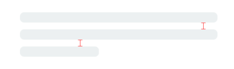
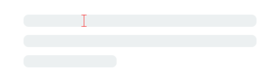

<p align="center">
    <a href="https://github.com/Juanpe/SkeletonView/actions?query=workflow%3ACI">
      
    </a>
    <a href="https://codebeat.co/projects/github-com-juanpe-skeletonview-main"></a>
    <a href="https://cocoapods.org/pods/SkeletonView"></a>
    <a href="https://github.com/Carthage/Carthage/"></a>
    <a href="https://swift.org/package-manager/"></a>
    
    <a href="https://badge.bow-swift.io/recipe?name=SkeletonView&description=An%20elegant%20way%20to%20show%20users%20that%20something%20is%20happening%20and%20also%20prepare%20them%20to%20which%20contents%20he%20is%20waiting&url=https://github.com/juanpe/skeletonview&owner=Juanpe&avatar=https://avatars0.githubusercontent.com/u/1409041?v=4&tag=1.20.0"></a>   
</p>

<p align="center">
    <a href="#-funktionen">Funktionen</a>
  • <a href="#-anleitungen">Anleitungen</a>
  • <a href="#-installation">Installation</a>
  • <a href="#-verwendung">Verwendung</a>
  • <a href="#-sonstiges">Sonstiges</a>
  • <a href="#️-beitragen">Beitragen</a>
</p>

**🌎 README ist auch in anderen Sprachen verfügbar: [🇬🇧](../README.md) . [🇪🇸](README_es.md) . [🇨🇳](README_zh.md) . [🇧🇷](README_pt-br.md) . [🇰🇷](README_ko.md) . [🇫🇷](README_fr.md)**

Heutzutage haben fast alle Anwendungen async-Prozesse, z.B. API-Anfragen, lang laufende Prozesse, usw. Während die Prozesse arbeiten, platzieren die Entwickler in der Regel eine Ladeansicht, um den Benutzern zu zeigen, dass im Hintergrund etwas vor sich geht.

**SkeletonView** wurde entwickelt, um dieses Bedürfnis zu befriedigen, indem auf eine elegante Art und Weise den Nutzern gezeigt wird, dass etwas passiert und sie gleichzeitig darauf vorbereitet, welche Inhalte sie erwarten.

Viel Spaß damit! 🙂

##

- [🌟 Funktionen](#-funktionen)
- [🎬 Anleitungen](#-anleitungen)
- [📲 Installation](#-installation)
- [🐒 Verwendung](#-verwendung)
  - [🌿 Sammlungen](#-sammlungen)
  - [🔠 Texte](#-texte)
  - [🦋 Erscheinungsbild](#-erscheinungsbild)
  - [🎨 Benutzerdefinierte Farben](#-benutzerdefinierte-farben)
  - [🏃‍♀️ Animationen](#️-animationen)
  - [🏄 Übergänge](#-übergänge)
- [✨ Sonstiges](#-sonstiges)
- [❤️ Beitragen](#️-beitragen)
- [📢 Erwähnungen](#-erwähnungen)
- [🏆 Sponsoren](#-sponsoren)
- [👨🏻‍💻 Autor](#-autor)
- [👮🏻 Lizenz](#-lizenz)


## 🌟 Funktionen

* Einfach zu benutzen
* Alle UIViews sind skelettierbar
* Vollständig anpassbar
* Universal (iPhone & iPad)
* Freundlicher interface builder
* Einfache Swift-Syntax
* Leicht lesbarer code


## 🎬 Anleitungen

| [](https://youtu.be/75kgOhWsPNA)|[](https://youtu.be/MVCiM_VdxVA)|[](https://youtu.be/Qq3Evspeea8)|[](https://www.youtube.com/watch?v=Zx1Pg1gPfxA)
|:---:  | :---:  | :---: | :---:
|[**SkeletonView Guides - Getting started**](https://youtu.be/75kgOhWsPNA)|[**How to Create Loading View with Skeleton View in Swift 5.2**](https://youtu.be/MVCiM_VdxVA)    by iKh4ever Studio|[**Create Skeleton Loading View in App (Swift 5) - Xcode 11, 2020**](https://youtu.be/Qq3Evspeea8)    by iOS Academy| [**Cómo crear una ANIMACIÓN de CARGA de DATOS en iOS**](https://www.youtube.com/watch?v=Zx1Pg1gPfxA) by MoureDev


## 📲 Installation

* [CocoaPods](https://guides.cocoapods.org/using/using-cocoapods.html):

```ruby
pod 'SkeletonView'
```

* [Carthage](https://github.com/Carthage/Carthage):

```ruby
github "Juanpe/SkeletonView"
```

* [Swift Package Manager](https://swift.org/package-manager/):

```swift
dependencies: [
  .package(url: "https://github.com/Juanpe/SkeletonView.git", from: "1.7.0")
]
```

> 📣 **WICHTIG!**
>
> Seit Version 1.30.0 unterstützt `SkeletonView` **XCFrameworks**, wenn du es also als **XCFramework** installieren möchtest, verwende bitte stattdessen [dieses Repo](https://github.com/Juanpe/SkeletonView-XCFramework.git).

## 🐒 Verwendung

Nur **3** Schritte sind erforderlich, um `SkeletonView` zu verwenden:

1️⃣ Importiere SkeletonView an der richtigen Stelle.

```swift
import SkeletonView
```

2️⃣ Lege nun fest, welche Ansichten `skelettierbar` sein sollen. Dies kannst du auf zwei Arten erreichen:

**Durch code:**

```swift
avatarImageView.isSkeletonable = true
```

**Durch IB/Storyboards:**


3️⃣ Sobald du die Views eingestellt hast, kannst du das **Skelett** anzeigen. Dazu hast du **4** Auswahlmöglichkeiten:

```swift
(1) view.showSkeleton()                 // Einfarbig
(2) view.showGradientSkeleton()         // Farbverlauf
(3) view.showAnimatedSkeleton()         // Einfarbig animiert
(4) view.showAnimatedGradientSkeleton() // Farbverlauf animiert
```

**Vorschau**

<table>
<tr>
<td width="25%">
<center>Einfarbig</center>
</td>
<td width="25%">
<center>Farbverlauf</center>
</td>
<td width="25%">
<center>Einfarbig animiert</center>
</td>
<td width="25%">
<center>Farbverlauf animiert</center>
</td>
</tr>
<tr>
<td width="25%">
</img>
</td>
<td width="25%">
</img>
</td>
<td width="25%">
</img>
</td>
<td width="25%">
</img>
</td>
</tr>
</table>

> 📣 **WICHTIG!**
>
> `SkeletonView` ist rekursiv, wenn du also das Skelett in allen skelettierbaren Views anzeigen willst, musst du nur die show-Methode in der Haupt-Container-View aufrufen. Zum Beispiel mit `UIViewControllers`.

### 🌿 Sammlungen

```SkeletonView``` ist kompatibel mit ```UITableView``` und ```UICollectionView```.

**UITableView**

Wenn du das Skelett in ```UITableView```'s anzeigen willst, müssen diese dem ```SkeletonTableViewDataSource```-Protokoll entsprechen.

``` swift
public protocol SkeletonTableViewDataSource: UITableViewDataSource {
    func numSections(in collectionSkeletonView: UITableView) -> Int // Standard: 1
    func collectionSkeletonView(_ skeletonView: UITableView, numberOfRowsInSection section: Int) -> Int
    func collectionSkeletonView(_ skeletonView: UITableView, cellIdentifierForRowAt indexPath: IndexPath) -> ReusableCellIdentifier
    func collectionSkeletonView(_ skeletonView: UITableView, skeletonCellForRowAt indexPath: IndexPath) -> UITableViewCell? // Standard: nil
    func collectionSkeletonView(_ skeletonView: UITableView, prepareCellForSkeleton cell: UITableViewCell, at indexPath: IndexPath)
}
```

Wie du sehen kannst, erbt dieses Protokoll von ```UITableViewDataSource```, so dass du dieses Protokoll durch das Skelettprotokoll ersetzen kannst.

Dieses Protokoll hat eine Standardimplementierung für einige Methoden. Zum Beispiel wird die Anzahl der Zeilen für jeden Abschnitt in Echtzeit berechnet:

``` swift
func collectionSkeletonView(_ skeletonView: UITableView, numberOfRowsInSection section: Int) -> Int
// Standard:
// Es wird berechnet, wie viele Zellen benötigt werden, um die gesamte Tabellenansicht zu füllen
```

> 📣 **WICHTIG!**
>
> Wenn du in der obigen Methode `UITableView.automaticNumberOfSkeletonRows` zurückgibst, verhält es sich wie das Standardverhalten (d.h. es wird berechnet, wie viele Zellen benötigt werden, um den gesamten Tableview zu füllen).

Es gibt nur eine Methode, die du implementieren musst, damit Skeleton die Zellen ID kennt. Diese Methode hat keine Standardimplementierung:

 ``` swift
 func collectionSkeletonView(_ skeletonView: UITableView, cellIdentifierForRowAt indexPath: IndexPath) -> ReusableCellIdentifier {
    return "CellIdentifier"
}
 ```

Standardmäßig entfernt die library die Zellen aus jedem indexPath, aber du kannst dies auch tun, wenn du einige Änderungen vornehmen möchtest, bevor das Skelett erscheint:

``` swift
 func collectionSkeletonView(_ skeletonView: UITableView, skeletonCellForRowAt indexPath: IndexPath) -> UITableViewCell? {
     let cell = skeletonView.dequeueReusableCell(withIdentifier: "CellIdentifier", for: indexPath) as? Cell
     cell?.textField.isHidden = indexPath.row == 0
     return cell
 }
 ```

Wenn du es vorziehst, den deque-Teil der Bibliothek zu überlassen, kannst du die Zelle mit dieser Methode konfigurieren:

 ``` swift
 func collectionSkeletonView(_ skeletonView: UITableView, prepareCellForSkeleton cell: UITableViewCell, at indexPath: IndexPath) {
     let cell = cell as? Cell
     cell?.textField.isHidden = indexPath.row == 0
 }
 ```

Außerdem kannst du sowohl die Kopf- als auch die Fußzeilen skelettieren. Diese müssen nur dem Protokoll "SkeletonTableViewDelegate" entsprechen.

```swift
public protocol SkeletonTableViewDelegate: UITableViewDelegate {
    func collectionSkeletonView(_ skeletonView: UITableView, identifierForHeaderInSection section: Int) -> ReusableHeaderFooterIdentifier? // standard: nil
    func collectionSkeletonView(_ skeletonView: UITableView, identifierForFooterInSection section: Int) -> ReusableHeaderFooterIdentifier? // standard: nil
}
```

> 📣 **WICHTIG!**
>
> 1️⃣ Wenn du größenvariable Zellen verwendest (**`tableView.rowHeight = UITableViewAutomaticDimension`**), ist es zwingend erforderlich, die **`estimatedRowHeight`** zu definieren.
>
> 2️⃣ Wenn man Elemente in einer **`UITableViewCell`** hinzufügt, sollte man sie dem **`contentView`** hinzufügen und nicht direkt in der Zelle.
>
> ```swift
> self.contentView.addSubview(titleLabel) ✅         
> self.addSubview(titleLabel) ❌
> ```

**UICollectionView**

Für `UICollectionView` musst du dem Protokoll `SkeletonCollectionViewDataSource` entsprechen.

``` swift
public protocol SkeletonCollectionViewDataSource: UICollectionViewDataSource {
    func numSections(in collectionSkeletonView: UICollectionView) -> Int  // standard: 1
    func collectionSkeletonView(_ skeletonView: UICollectionView, numberOfItemsInSection section: Int) -> Int
    func collectionSkeletonView(_ skeletonView: UICollectionView, cellIdentifierForItemAt indexPath: IndexPath) -> ReusableCellIdentifier
    func collectionSkeletonView(_ skeletonView: UICollectionView, supplementaryViewIdentifierOfKind: String, at indexPath: IndexPath) -> ReusableCellIdentifier? // standard: nil
    func collectionSkeletonView(_ skeletonView: UICollectionView, skeletonCellForItemAt indexPath: IndexPath) -> UICollectionViewCell?  // standard: nil
    func collectionSkeletonView(_ skeletonView: UICollectionView, prepareCellForSkeleton cell: UICollectionViewCell, at indexPath: IndexPath)
    func collectionSkeletonView(_ skeletonView: UICollectionView, prepareViewForSkeleton view: UICollectionReusableView, at indexPath: IndexPath)
}
```

Der Rest des Prozesses ist derselbe wie bei ```UITableView```

### 🔠 Texte


Wenn Elemente mit Text verwendet werden, zeichnet ```SkeletonView``` Linien, um Text zu simulieren.

Du kannst einige Variablen für mehrzeilige Elemente einstellen.

| Variable | Typ | Standard | Vorschau
| ------- | ------- |------- | -------
| **lastLineFillPercent**  | `CGFloat` | `70`| 
| **linesCornerRadius**  | `Int` | `0` | 
| **skeletonLineSpacing**  | `CGFloat` | `10` | 
| **skeletonPaddingInsets**  | `UIEdgeInsets` | `.zero` | 
| **skeletonTextLineHeight**  | `SkeletonTextLineHeight` | `.fixed(15)` | 
| **skeletonTextNumberOfLines**  | `SkeletonTextNumberOfLines` | `.inherited` | 

<br />

Um den Prozentsatz oder den Radius **mit Hilfe von Code** zu ändern, lege diese Variablen fest:

```swift
descriptionTextView.lastLineFillPercent = 50
descriptionTextView.linesCornerRadius = 5
```

Oder, wenn du es vorziehst, verwende **IB/Storyboard**:


<br />

**Wie kann die Anzahl der Zeilen festgelegt werden?**

Standardmäßig entspricht die Anzahl der Linien dem Wert der Variable `numberOfLines`. Und wenn es auf **null** gesetzt ist, wird berechnet, wie viele Linien benötigt werden, um das gesamte Skelett zu füllen und es zu zeichnen.

Wenn du jedoch eine bestimmte Anzahl von Zeilen für das Skelett festlegen möchtest, kannst du dies mit der Variable `skeletonTextNumberOfLines` tun. Diese Variable hat zwei mögliche Werte: `inherited`, der den Wert `numberOfLines` zurückgibt, und `custom(Int)`, der die spezifische Anzahl von Zeilen zurückgibt, die als zugehöriger Wert angegeben wurde.

Zum Beispiel:

```swift
label.skeletonTextNumberOfLines = 3   // .custom(3)
```

<br />

> **⚠️ VERALTET!**
>
> **useFontLineHeight** wurde abgeschafft. Du kannst stattdessen **skeletonTextLineHeight** verwenden:
>
> ```swift
> descriptionTextView.skeletonTextLineHeight = .relativeToFont
> ```

> **📣 WICHTIG!**
>
> Bitte beachte, dass bei Ansichten ohne mehrere Zeilen die einzelne Zeile
> als letzte Zeile betrachtet wird.

### 🦋 Erscheinungsbild

Die Skelette haben ein Standardaussehen. Wenn du also die Farbe, den Farbverlauf oder Mehrlinien-Eigenschaften nicht angibst, verwendet `SkeletonView` die Standardwerte.

Standardwerte:

- **tintColor**: `UIColor`
  - *standard: `.skeletonDefault` (gleich wie `.clouds`, aber anpassungsfähig an den dunklen Modus)*
- **gradient**: SkeletonGradient
  - *standard: `SkeletonGradient(baseColor: .skeletonDefault)`*
- **multilineHeight**: `CGFloat`
  - *standard: 15*
- **multilineSpacing**: `CGFloat`
  - *standard: 10*
- **multilineLastLineFillPercent**: `Int`
  - *standard: 70*
- **multilineCornerRadius**: `Int`
  - *standard: 0*
- **skeletonCornerRadius**: `CGFloat` (IBInspectable)(Macht ihre Skelettansicht mit Ecken)
  - *standard: 0*

Um diese Standardwerte zu erhalten, kannst du `SkeletonAppearance.default` verwenden. Mit dieser Variable kannst du auch die Werte einstellen:

```swift
SkeletonAppearance.default.multilineHeight = 20
SkeletonAppearance.default.tintColor = .green
```

> **⚠️ VERALTET!**
>
> **useFontLineHeight** wurde abgeschafft. Du kannst stattdessen **textLineHeight** verwenden:
>
> ```swift
> SkeletonAppearance.default.textLineHeight = .relativeToFont
> ```

### 🎨 Benutzerdefinierte Farben

Du kannst entscheiden, mit welcher Farbe das Skelett eingefärbt wird. Du brauchst nur die gewünschte Farbe oder den gewünschten Farbverlauf als Parameter zu übergeben.

**Verwendung von Volltonfarben**

```swift
view.showSkeleton(usingColor: UIColor.gray) // Einfarbig
// oder
view.showSkeleton(usingColor: UIColor(red: 25.0, green: 30.0, blue: 255.0, alpha: 1.0))
```

**Verwendung von Farbverläufen**

```swift
let gradient = SkeletonGradient(baseColor: UIColor.midnightBlue)
view.showGradientSkeleton(usingGradient: gradient) // Farbverlauf
```

Außerdem bietet **SkeletonView** 20 flache Farben 🤙🏼.

```UIColor.turquoise, UIColor.greenSea, UIColor.sunFlower, UIColor.flatOrange ...```


###### Bild von der Website [https://flatuicolors.com](https://flatuicolors.com) entnommen


### 🏃‍♀️ Animationen

**SkeletonView** hat zwei eingebaute Animationen, *pulse* für einfarbige Skelette und *sliding* für Farbverläufe.

Außerdem ist es sehr einfach, eine eigene Skelettanimationen zu erstellen.

Skeleton bietet die Funktion `showAnimatedSkeleton`, die eine Closure ```SkeletonLayerAnimation``` besitzt, in der du deine eigene Animation definieren kannst.

```swift
public typealias SkeletonLayerAnimation = (CALayer) -> CAAnimation
```

Du kannst die Funktion wie folgt aufrufen:

```swift
view.showAnimatedSkeleton { (layer) -> CAAnimation in
  let animation = CAAnimation()
  // Passe hier ihre Animation an

  return animation
}
```

Es ist ein ```SkeletonAnimationBuilder``` verfügbar. Es ist ein Builder um ```SkeletonLayerAnimation``` zu erstellen.

Heute kann man **Gleitanimationen** für Farbverläufe erstellen, indem man die **Richtung** und die **Dauer** der Animation festlegt (Standard = 1,5s).

```swift
// func makeSlidingAnimation(withDirection direction: GradientDirection, duration: CFTimeInterval = 1.5) -> SkeletonLayerAnimation

let animation = SkeletonAnimationBuilder().makeSlidingAnimation(withDirection: .leftToRight)
view.showAnimatedGradientSkeleton(usingGradient: gradient, animation: animation)

```

```GradientDirection``` ist ein enum, mit den folgenden cases:

| Richtung | Vorschau
|------- | -------
| .leftRight | 
| .rightLeft | 
| .topBottom | 
| .bottomTop | 
| .topLeftBottomRight | 
| .bottomRightTopLeft | 

> **😉 TRICK!**
>
> Es gibt noch eine andere Möglichkeit, Schiebeanimationen zu erstellen, indem man einfach diese Abkürzung benutzt:
>
> ```swift
> let animation = GradientDirection.leftToRight.slidingAnimation()
> ```

### 🏄 Übergänge

**SkeletonView** hat eingebaute Übergänge, um die Skelette auf eine *ruhigere* Weise **ein- und auszublenden** 🤙.

Um den Übergang zu benutzen, füge einfach den Parameter ```transition``` zu ihrer Funktion ```showSkeleton()``` oder ```hideSkeleton()``` mit der Übergangszeit hinzu, wie hier:

```swift
view.showSkeleton(transition: .crossDissolve(0.25))     //Einblenden des Skeleton mit Querauflösen-Übergang mit 0,25 Sekunden Übergangszeit
view.hideSkeleton(transition: .crossDissolve(0.25))     //Ausblenden des Skeleton mit Querauflösen-Übergang mit 0,25 Sekunden Übergangszeit

```

Der Standardwert ist `crossDissolve(0.25)`

**Vorschau**

<table>
<tr>
<td width="50%">
<center>Keinen</center>
</td>
<td width="50%">
<center>Querauflösen</center>
</td>
</tr>
<tr>
<td width="50%">
</img>
</td>
<td width="50%">
</img>
</td>
</tr>
</table>

## ✨ Sonstiges

**Hierarchie**

Da ```SkeletonView``` rekursiv ist, und wir wollen, dass Skeleton sehr effizient ist, wollen wir die Rekursion so schnell wie möglich beenden. Aus diesem Grund musst du die Container-Ansicht auf `Skeletonable` setzen, denn Skeleton wird aufhören, nach `skeletonable` Unteransichten zu suchen, sobald eine Ansicht nicht skelettierbar ist, und damit die Rekursion beenden.

Denn ein Bild sagt mehr als tausend Worte:

In diesem Beispiel haben wir einen `UIViewController` mit einem `ContainerView` und einem `UITableView`. Wenn der View fertig ist, zeigen wir das Skelett mit dieser Methode:

```
view.showSkeleton()
```

> ```isSkeletonable```= ☠️

| Konfiguration | Ergebnis|
|:-------:|:-------:|
| | |
| | |
| | |
|| |
| | |
| | |

**Skelettansichten-Layout**

Manchmal kann es vorkommen, dass das Skelett-Layout nicht zu ihrem Layout passt, weil sich die Grenzen der übergeordneten Ansicht geändert haben. ~Zum Beispiel, wenn du das Gerät drehst.

Du kannst die Skelettansichten wie folgt neu anordnen:

```swift
override func viewDidLayoutSubviews() {
    view.layoutSkeletonIfNeeded()
}
```

> 📣 **WICHTIG!**
>
> Du solltest diese Methode nicht aufrufen. Ab **Version 1.8.1** brauchst du diese Methode nicht mehr aufzurufen, die Bibliothek macht das automatisch. Du kannst diese Methode also **NUR** in den Fällen verwenden, in denen du das Layout des Skeletts manuell aktualisieren musst.

**Skelett aktualisieren**

Du kannst die Konfiguration des Skeletts jederzeit ändern, wie z.B. seine Farbe, Animation, etc. mit den folgenden Methoden:

```swift
(1) view.updateSkeleton()                 // Einfarbig
(2) view.updateGradientSkeleton()         // Farbverlauf
(3) view.updateAnimatedSkeleton()         // Einfarbig animiert
(4) view.updateAnimatedGradientSkeleton() // Farbverlauf animiert
```

**Ausblenden von Ansichten, wenn die Animation beginnt**

Manchmal möchte man einige Ansichten ausblenden, wenn die Animation beginnt. Dafür gibt es eine praktische Variable, die man benutzen kann:

```swift
view.isHiddenWhenSkeletonIsActive = true  // Dies funktioniert nur, wenn isSkeletonable = true
```

**Benutzerinteraktion nicht ändern, wenn das Skelett aktiv ist**

Standardmäßig ist die Benutzerinteraktion für skelettierte Elemente deaktiviert, aber wenn du den Indikator für die Benutzerinteraktion nicht ändern willst, wenn das Skelett aktiv ist, kannst du die Variable `isUserInteractionDisabledWhenSkeletonIsActive` verwenden:

```swift
view.isUserInteractionDisabledWhenSkeletonIsActive = false  // Die Ansicht wird aktiv sein, wenn das Skelett aktiv ist.
```

**Zeilenhöhe der Schriftart für die Skelettlinien in Labels nicht verwenden**

`False`, um die automatische Anpassung des Skeletts an die Schrifthöhe für ein `UILabel` oder `UITextView` zu deaktivieren. Standardmäßig wird die Höhe der Skelettlinien automatisch an die Schrifthöhe angepasst, um den Text im Label-Rect genauer wiederzugeben, anstatt die Bounding Box zu verwenden.

```swift
label.useFontLineHeight = false
```

**Skelett verzögert anzeigen**

Du kannst die Darstellung des Skeletts verzögern, wenn die Ansichten schnell aktualisiert werden.

```swift
func showSkeleton(usingColor: UIColor,
                  animated: Bool,
                  delay: TimeInterval,
                  transition: SkeletonTransitionStyle)
```

```swift
func showGradientSkeleton(usingGradient: SkeletonGradient,
                          animated: Bool,
                          delay: TimeInterval,
                          transition: SkeletonTransitionStyle)
```

**Debug**

Um die Debug-Aufgaben zu erleichtern, wenn etwas nicht richtig funktioniert, hat **`SkeletonView`** einige neue Werkzeuge.

Erstens, `UIView` hat eine Variable mit seinen Skelett-Informationen zur Verfügung:

```swift
var sk.skeletonTreeDescription: String

```

Außerdem kannst du den neuen **Debug-Modus** aktivieren. Füge einfach die Umgebungsvariable `SKELETON_DEBUG` hinzu um ihn zu aktivieren.


Wenn das Skelett dann erscheint, kannst du die Ansichtshierarchie in der Xcode-Konsole sehen.

```
{ 
  "type" : "UIView", // UITableView, UILabel...
  "isSkeletonable" : true,
  "reference" : "0x000000014751ce30",
  "children" : [
    {
      "type" : "UIView",
      "isSkeletonable" : true,
      "children" : [ ... ],
      "reference" : "0x000000014751cfa0"
    }
  ]
}
```
  
**Unterstützte OS & SDK-Versionen**

- iOS 9.0+
- tvOS 9.0+
- Swift 5.3

## ❤️ Beitragen

Dies ist ein Open-Source-Projekt, du kannst also gerne dazu beitragen. Wie?

- Eröffne ein [issue](https://github.com/Juanpe/SkeletonView/issues/new).
- Sende Feedback über [email](mailto://juanpecatalan.com).
- Schlage deine eigenen Korrekturen und Vorschläge vor und öffne einen Pull Request mit den Änderungen.

Siehe [alle Mitwirkenden](https://github.com/Juanpe/SkeletonView/graphs/contributors)

Für weitere Informationen lies bitte die [contributing guidelines](https://github.com/Juanpe/SkeletonView/blob/main/CONTRIBUTING.md).

## 📢 Erwähnungen

- [iOS Dev Weekly #327](https://iosdevweekly.com/issues/327#start)
- [Hacking with Swift Articles](https://www.hackingwithswift.com/articles/40/skeletonview-makes-loading-content-beautiful)
- [Top 10 Swift Articles November](https://medium.mybridge.co/swift-top-10-articles-for-the-past-month-v-nov-2017-dfed7861cd65)
- [30 Amazing iOS Swift Libraries (v2018)](https://medium.mybridge.co/30-amazing-ios-swift-libraries-for-the-past-year-v-2018-7cf15027eee9)
- [AppCoda Weekly #44](http://digest.appcoda.com/issues/appcoda-weekly-issue-44-81899)
- [iOS Cookies Newsletter #103](https://us11.campaign-archive.com/?u=cd1f3ed33c6527331d82107ba&id=48131a516d)
- [Swift Developments Newsletter #113](https://andybargh.com/swiftdevelopments-113/)
- [iOS Goodies #204](http://ios-goodies.com/post/167557280951/week-204)
- [Swift Weekly #96](http://digest.swiftweekly.com/issues/swift-weekly-issue-96-81759)
- [CocoaControls](https://www.cocoacontrols.com/controls/skeletonview)
- [Awesome iOS Newsletter #74](https://ios.libhunt.com/newsletter/74)
- [Swift News #36](https://www.youtube.com/watch?v=mAGpsQiy6so)
- [Best iOS articles, new tools & more](https://medium.com/flawless-app-stories/best-ios-articles-new-tools-more-fcbe673e10d)

## 🏆 Sponsoren

Open-Source-Projekte leben nicht lange ohne ihre Hilfe. Wenn du **SkeletonView** nützlich findest, ziehe bitte in Betracht, dieses
Projekt zu unterstützen, indem du ein Sponsor wirst.

Werde Sponsor über [GitHub Sponsors] (<https://github.com/sponsors/Juanpe>) :heart:

## 👨🏻‍💻 Autor

[Juanpe Catalán](http://www.twitter.com/JuanpeCatalan)

<a class="bmc-button" target="_blank" href="https://www.buymeacoffee.com/CDou4xtIK"><span style="margin-left:5px"></span></a>

## 👮🏻 Lizenz

```
MIT License

Copyright (c) 2017 Juanpe Catalán

Permission is hereby granted, free of charge, to any person obtaining a copy
of this software and associated documentation files (the "Software"), to deal
in the Software without restriction, including without limitation the rights
to use, copy, modify, merge, publish, distribute, sublicense, and/or sell
copies of the Software, and to permit persons to whom the Software is
furnished to do so, subject to the following conditions:

The above copyright notice and this permission notice shall be included in all
copies or substantial portions of the Software.

THE SOFTWARE IS PROVIDED "AS IS", WITHOUT WARRANTY OF ANY KIND, EXPRESS OR
IMPLIED, INCLUDING BUT NOT LIMITED TO THE WARRANTIES OF MERCHANTABILITY,
FITNESS FOR A PARTICULAR PURPOSE AND NONINFRINGEMENT. IN NO EVENT SHALL THE
AUTHORS OR COPYRIGHT HOLDERS BE LIABLE FOR ANY CLAIM, DAMAGES OR OTHER
LIABILITY, WHETHER IN AN ACTION OF CONTRACT, TORT OR OTHERWISE, ARISING FROM,
OUT OF OR IN CONNECTION WITH THE SOFTWARE OR THE USE OR OTHER DEALINGS IN THE
SOFTWARE.
```
